# 第1回　クリエイティブ・コーディング入門
## p5.jsの基礎操作

---

## このゼミの内容
- p5.js というJavaScriptライブラリを利用してグラフィック制作を行う
- 基本的な内容（前半）
  - 2Dキャンバスに使ったグラフィックの描画
  - 幾何学図形や色を使った「パターン」を作る
  - グリッドをつかった規則的パターン、乱数を使ったパターンなど
- 応用的な内容（後半）
  - 音源ファイルやマイクを用いた音の可視化
  - 機械学習ライブラリを使った姿勢や顔、手の検出

---

## クリエイティブ・コーディングについて
- クリエイティブ・コーディングとは、**プログラミングを「表現の手段」として用いる創作活動**のこと 
- プログラミングを描画ツールとして扱い、視覚的な表現を行う
- 一般的なプログラミングが「問題解決」や「効率化」を目的とするのに対し、クリエイティブ・コーディングは **「表現」** や **「創作」** を目的としている  
- 本ゼミでは**p5.js** を用いた視覚表現の基本を学んでいく

---

## p5.jsについて
- **JavaScript**を基盤とした、オープンソースのライブラリ
- アート領域におけるプログラミング教育用に作られた
- 視覚的な結果を即座に確認できるので、直感的にプログラミングができる
- Webブラウザ上で動かせるため、特別な環境が必要ない


---

<!-- _unsafe: true -->
<style>
.twocol {
  display: flex;
  justify-content: center;
  align-items: center;
  gap:30px;              /* ← ここで間隔を調整 */
  width: 85%;
  margin: 0 auto;
}
.twocol .geometric_pattern_1 {
  width: 40%;     /* ← 左の画像のサイズ */
}
.twocol .geometric_pattern_2 {
  width: 50%;     /* ← 右の画像のサイズ */
}
.footer {
  font-size: 0.75em !important;
  color: yellow;
}
.footer a {
  color: black;
  text-decoration: none;
}

</style>


<!-- _unsafe: true -->
<style>
.center-img {
  display: block;
  margin: 0 auto;
}
</style>


# デモコードを動かしてみる


---

## [色と図形のランダムなパターン](https://editor.p5js.org/takano_ma/sketches/-DQQ2vt6L)← クリックしてweb editorへ

- 色と図形のサイズを乱数によって自動調整
- ▶️ で再実行するごとに、色と図形の配置パターンが変わる

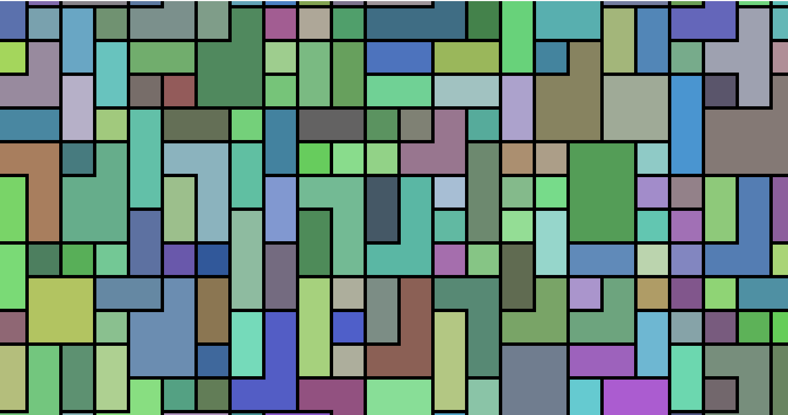

---

## [マウスクリックで波紋を描画](http://editor.p5js.org/takano_ma/sketches/irSBeL9Yt)← クリックしてweb editorへ

- クリック位置から波紋が生成され、広がりながら消えていく
- 描画クラスを作り、lifespan変数でインスタンスを削除する方法はよく使う


---

## [パーティクルシステム](https://editor.p5js.org/takano_ma/sketches/kplV6yBAz) ← クリックしてweb editorへ

- **ジェネラティブ・アート**やWebサイトでよく使われる表現
- 自律的に動くドット同士の距離に応じて、ノードが表示される
- `num`でドットの個数を増やしたり、`node_dist`でノードの長さを調整


---
## [カレイドスコープ（万華鏡）](https://editor.p5js.org/takano_ma/sketches/HaOo9WPYx)← クリックしてweb editorへ

- ▶️ ボタンがあるのでそれを押すと動かせる
- マウスをクリックしながら動かすと、万華鏡のような模様が描ける

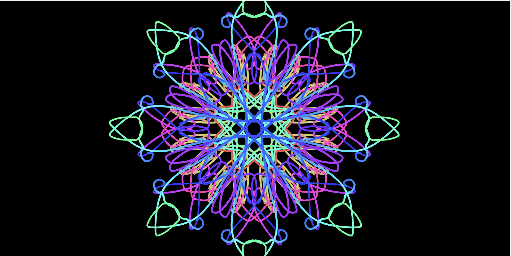

---

## [カレイドスコープ（万華鏡）](https://editor.p5js.org/takano_ma/sketches/HaOo9WPYx)のコードを書き換えてみる

- サンプルコードを少し変えることで、色々な表現にアレンジ
- draw()関数内の`background(0, 3);`のコメントアウトを外してみる
- ▶️ で再実行すると、残像のような表現にできる

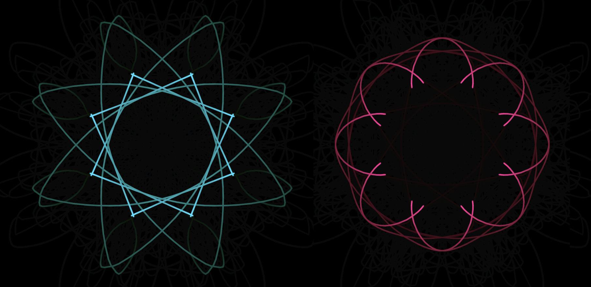

---

## [カメラの映像を使った描画](https://editor.p5js.org/takano_ma/sketches/cZ0bfE_us)

- PCのWebカメラの映像を使ってパーティクルを生成
- 前フレームのピクセル値（色）の差分が大きい場所からパーティクルを生成

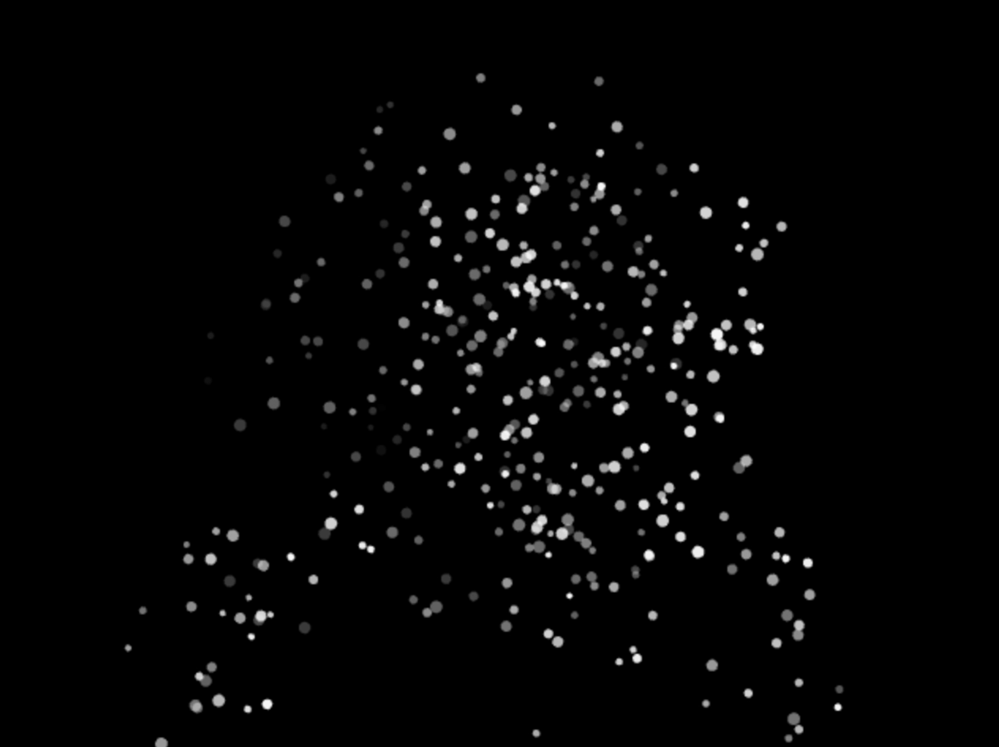

---

## [カメラからの姿勢検知](https://editor.p5js.org/takano_ma/sketches/jMQl2Fdg6)

- Google の 画像認識ライブラリ MediaPipe を利用
- 顔や身体の位置情報を映像や画像から取得できる

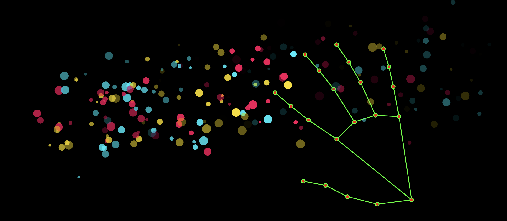

---

# p5.jsの開発環境

---

## 環境の準備
まずp5.jsを始めるには、コードを書いて実行するための「開発環境」が必要で、
主に2つの選択肢がある

1.  **p5.js Web Editor** (オンライン)
2.  **Visual Studio Code (VS Code)** (ローカル)

今回ははWeb Editor を使っていく

---

## 開発環境: p5.js Web Editor
Webブラウザで利用できる、最も手軽な開発環境

- **長所**:
    - ソフトウェアのインストールが不要
    - 作成したコードの保存や共有が容易
- **短所**:
    - オフラインでは利用できない
    - 容量の大きいファイルは扱えない（音声ファイルや3Dモデルなど）
      - 大きいプロジェクトはVS Codeを使ってローカルで作業するのが良い

---

## Web Editorの使い方

1. https://editor.p5js.org/ でweb editorのページにアクセス
2. 左側にプログラムを書く部分が表示されるので
- (アカウントがない場合は Sign in で作っておく)

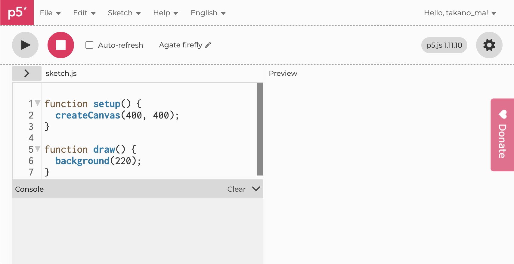

---

## Web Editorの構成要素

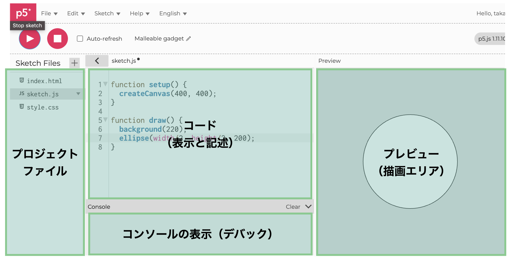

---

## Web EditorのUI

- 上部にはコードの実行や保存の設定を行うUIが表示されている
- アカウントを作っておくと、作成したコードを保存しておける

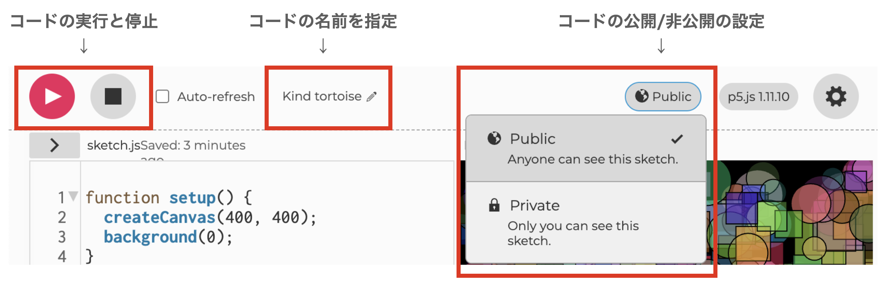

---

## p5.jsのプロジェクト・ファイル

- p5.jsはWEBの「フロントエンド」側のプログラムでできている
- **index.html**  
  webページの「骨組み」、ここでp5.jsのライブラリと `sketch.js` を読み込む
- **style.css**  
  ページ全体のデザインを指定するファイル（背景や文字の色など）
- **sketch.js**（← 基本的にこれしか変更はしない）
  図形やアニメーションの指示を書いていくファイル


---

# p5.jsの基本構造

p5.jsのプログラムは、2つの重要な関数から構成される
- `setup()`：プログラム実行時に一度だけ実行される関数
- `draw()`：内容が繰り返し（初期値:60fps）実行される関数

```javascript
function setup() {
  createCanvas(400, 400);
  // キャンバスの作成や初期設定を行う
  // 一度だけ実行されるので、静止画やパターンを描くこともできる
}

function draw() {
  // 繰り返し行いたい描画処理（動き・アニメーション）を記述する
}
```
---

# setup()関数による初期設定と静止画の作成

---

# setup()関数でキャンバスを設定する

- `setup()` は一度だけ実行される関数
- 一枚の静止画を描く場合は、ここで記述できる
- まず`createCanvas(横幅, 縦幅)`でキャンバスの大きさを設定
- `createCanvas(windowWidth, windowHeight)`でブラウザのウィンドサイズに設定
- キャンバスのサイズは**ピクセル単位**になっている

```javascript
function setup() {
  createCanvas(400, 400); // 横幅400px, 縦幅400pxのキャンバスに設定
}
```

---

# キャンバス全体の背景色を設定する

- `background()` 関数で、キャンバス全体の背景色を設定 
- 引数1のみの場合はグレースケール（0〜255の数値を指定、 0=黒, 255=白）  
- 引数1~3を指定するとRGBによる指定（R = 赤, G = 緑, B = 青）
- 引数1~4まで指定するとRGBAによる指定（A = Alpha, 透明度）

```javascript
function setup() {
  createCanvas(400, 400);
  background(220); // グレーの背景を塗る
}
```

---

# 色の指定について（RGB）

- 色は「光の三原色（R, G, B）」で表現されている
- p5.jsでは0〜255 の範囲でそれぞれの色の値を指定する
- RGBの値を調整することでさまざまな色を表現できる

```javascript
function setup() {
  createCanvas(400, 400);
  background(255, 255, 0); // 背景色を黄色に
}
```

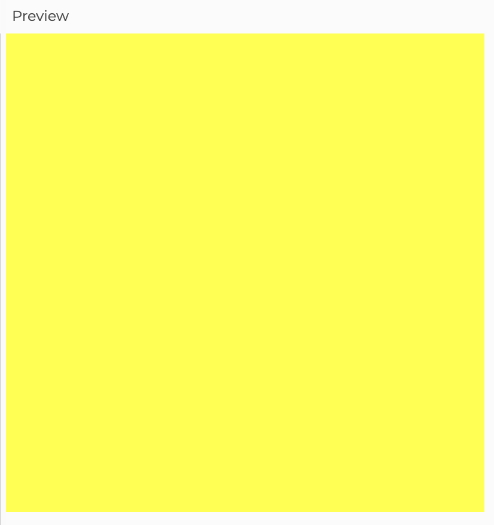

---

# 図形を描く

- 関数を使って、位置と大きさを指定した図形を描画できる
- `ellipse(x, y, w, h)`：(x, y) を中心とした円を描く
- `rect(x, y, w, h)`：(x, y) を左上とした四角形を描く
- **描画は上から順に実行されるため、後に書かれた図形が手前に重なる**

```javascript
function setup() {
  createCanvas(400, 400);
  background(240); // 背景（最初に描画＝一番後ろ）

  ellipse(100, 200, 200, 200); // 2番目に描画

  rect(150, 100, 200, 200); // 最後に描画 ＝ 一番手前に表示
}
```

---


# キャンバスと座標系

- `createCanvas(幅, 高さ)` で描画用キャンバスを作成
- p5.jsの座標系では、**左上が原点 (0, 0)**  
- X軸は右方向に、Y軸は下方向に増加する

```javascript
function setup() {
  createCanvas(400, 400); // 幅400px, 高さ400pxのキャンバスを作成
  background(240);
  
  ellipse(0, 0, 100, 100);     // 原点(0, 0)：左上に一部見切れる円
  ellipse(200, 200, 100, 100); // 中心(200, 200)：画面中央
  ellipse(400, 400, 100, 100); // 右下(400, 400)：見切れる円
}
```


---

## コンピュータ・グラフィックスの座標系のイメージ

- p5.jsでは、左上を原点(0, 0)とする座標系で位置を指定
- 通常の座標系とは異なり、y軸は下方向に増加
<div class="twocol">
  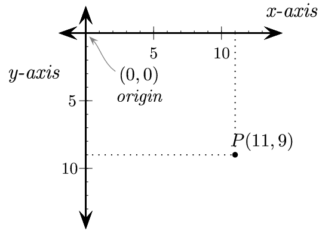
</div>

<div class="footer">
  <a href="https://fcs-cs.github.io/cs1-2018/modules/01-introduction/computer-coordinates/">参考サイト：<u>Coordinate Systems in Computers</u></a>
</div>

---

# 図形に色をつける

- `fill()` は塗りつぶし色、`stroke()` は線の色
- `strokeWeight`は線の太さ

```javascript
function setup() {
  createCanvas(400, 400);
  background(255);
  strokeWeight(5); // 線の太さを5px
  stroke(0, 255, 0); // 線を緑色に
  fill(255, 0, 0);  // 塗りつぶしを赤に
  ellipse(80, 200, 80, 80); //
  stroke(255, 0, 0); //線を赤色に
  fill(0, 0, 255);  // 塗りつぶしを青に
  ellipse(320, 200, 80, 80);
}
```

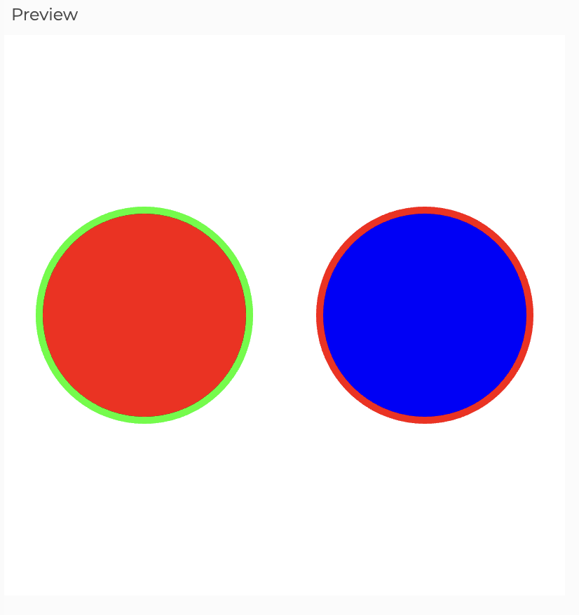

---

# 図形の種類

p5.jsには、さまざまな図形を描く関数が用意されている

- `ellipse(x, y, w, h)`：(x, y)を中心とした円を描く
- `rect(x, y, w, h)`：(x, y) を左上とした四角形を描く
- `line(x1, y1, x2, y2)`：線  
- `point(x, y)`：点  
- `triangle(x1, y1, x2, y2, x3, y3)`：三角形  
- `arc(x, y, w, h, start, stop)`：円弧  （角度はラジアン指定）

<div class="footer"><a>* 今回はellipse と rectのみ使用</a></div>


---

# 線や塗りをなくす

- `noStroke()`：図形の**線（枠）を描かない**  
- `noFill()`：図形の**塗りつぶしをしない**  
- `fill()` や `stroke()` と組み合わせて、表現を調整できる  

```javascript
function setup() {
  createCanvas(400, 400);
  background(255);
  noStroke();   // 線を非表示
  fill(0, 100, 255);    // 青で塗りつぶす
  ellipse(100, 200, 100, 100);
  stroke(255, 0, 0);    // 赤い線
  strokeWeight(4);  // 線の太さを指定
  noFill(); // 塗りつぶしを非表示
  rect(220, 150, 120, 100);
}
```

---

## for文で規則的なパターンを描く

- `for`文を使うと、規則的な並びを作ることができる  
- `setup()`内で実行すると、静止画として一度だけ描かれる
- `for(let i = 0; i<10; i++){}` で{}内の処理を10回繰り返す

```javascript
function setup() {
  createCanvas(400, 400);
  background(255);
  noStroke();
  fill(0, 150, 255);

  for (let i = 0; i < 10; i++) {
    ellipse(i * 40 + 20, height/2, 30, 30); //横方向に40ピクセル間隔で円を描画
  }
}
```

---

## for文の入れ子でグリッド模様を描く

- for文を2重にして縦横に円を並べてグリッド状のパターンを作成

```javascript
function setup() {
  createCanvas(400, 400);
  background(255);
  noStroke();
  fill(0, 150, 255);

  //10×10のグリッド状のパターンを描く
  for (let i = 0; i < 10; i++) {
    for (let j = 0; j < 10; j++){
        ellipse(i * 40 + 20, j * 40 + 20, 30, 30);
    }
  }
}
```

---

# random()でランダムなパターン

- `random(引数1, 引数2)`：指定範囲のランダムな値を生成  
- `width` = キャンバスの横幅, `height` = キャンバスの縦幅
- 乱数による調整を一部入れることで、規則性と偶然性を組み合わせられる

```javascript
function setup() {
  createCanvas(400, 400);
  background(0);
  noStroke();
  // 100個の円をランダムな位置に描画
  for (let i = 0; i < 100; i++) {
    fill(255, random(255), 0); //赤に混ぜる緑色をランダムに設定
    //キャンバスのランダムな位置に，ランダムなサイズの円を描画
    ellipse(random(width), random(height), random(10, 40)); 
  }
}
```

---

# draw()関数を使った描画

---

# draw()を使った繰り返し描画

- `draw()` は毎フレーム呼ばれる（1秒に約60回）  
- `background()` を入れると、前の絵を消して動きを作れる

```javascript
function setup() {
  createCanvas(400, 400);
  frameRate(10); // 変化が早すぎるのでfpsを10に
}

function draw() {
  background(0);
  ellipse(random(width), random(height), 50, 50);
}
```

---

# backgroundを使わない場合

- `background()`を書かないと、前の描画が残る  
- 図形が積み重なっていくような表現ができる

```javascript
function setup() {
  createCanvas(400, 400);
  background(0);
  noStroke();
}

function draw() {
  fill(random(255), random(255), random(255), 100);
  ellipse(random(width), random(height), random(10, 40));
}
```

---

# backgroundの透明度で残像を作る

- `background(色, 透明度)` の第2引数で「残像の強さ」を調整できる  
- 透明度の数値が小さいほど残像が長く残るようになる

```javascript
function setup() {
  createCanvas(400, 400);
  noStroke();
  background(0);
}

function draw() {
  background(0, 5); // 背景をうっすら上書きして残像を表現
  fill(random(255), random(255), random(255));
  ellipse(random(width), random(height), random(10, 50));
}
```

---

# if文を使って図形を変える

- randomとifを組み合わせて、描画する図形を変えることも可能

```javascript
function setup() {
  createCanvas(400, 400);
  background(0);
}

function draw() {
  fill(random(255), random(255), random(255), random(50, 200));
  //random(10) < 5 のとき円、それ以外は四角を描く
  if(random(10) < 5){
    ellipse(random(width), random(height), random(20, 50));
  }else{
    rect(random(width), random(height), random(20, 50));
  }
}
```

---

## 演習：繰り返しと乱数を使った色と配置の表現をしてみる

---

## テンプレート①：setup()で静止的なデザインを作る
- for文を使って、ランダムに図形を配置するコード
- `random()`を使って、色や大きさ、配置をアレンジしてみる
- `ellipse`ではなく`rect`など他の図形を使ってみるなど


```javascript
function setup() {
  createCanvas(400, 400);
  noStroke();

  for (let i = 0; i < 100; i++) {
    fill(random(255), random(255), random(255));
    ellipse(random(width), random(height), random(20, 50));
  }
}
```

---

## テンプレート②：draw()で動く表現を作る
- draw()内でellipse()などを繰り返し描画してみよう
- background()を使わず、毎フレーム図形を追加してアニメーションにしてみる


```javascript
function setup() {
  createCanvas(400, 400);
  noStroke();
}

function draw() {
  fill(random(255), random(255), random(255), 100);
  ellipse(random(width), random(height), random(10, 40));
}
```

---

## まとめ
- p5.jsは、`setup()` で初期設定を、`draw()` で繰り返し描画処理を行う
- 画面の左上が原点(0, 0)の座標系を`setup()`内の`createCanvas()`で指定
- `ellipse()`や`rect()`などによる図形の描画
- `fill()`や`stroke()`による図形の色を指定
- `for文` を使った繰り返しによる複数の図形の描画
- `random()` を使った色や図形の大きさなど偶然性を取り入れた描画

---

# 参考資料

---

## 参考サイト：p5.js Exampleページ

- https://p5js.org/examples/ にてp5.jsを使ったサンプルコードが見れる
- 基本的な描画から応用的なものまで記載されている


---

## 参考サイト：[OpenProcessing](https://openprocessing.org/)
- p5.js などで制作した作品をweb上で公開・共有できるプラットフォーム
- 各作品のコードが公開 されており、ブラウザ上で閲覧・実行・編集 が可能
- 表現の参考になるクリエイターの作品が多くアップされている


---

## 参考 YouTube Ch : [Coding Train](https://www.youtube.com/@TheCodingTrain/videos)

- Daniel Shiffman のYouTube
- ジェネラティブ・アートの書籍も執筆している
- [Nature of Code](https://natureofcode.com/) は物理シミュレーションを用いた表現を解説


---

## 書籍 : [Generative Design](https://www.youtube.com/@TheCodingTrain/videos)

- p5.jsを使った色々なデザイン例が載っている書籍
- ラーニングコモンズに配下しています


---

# 補足：JavaScriptの記述

---

## 変数の宣言

- 変数の宣言には、主に `let` と `const` を使用  

```javascript
let x = 100;   // 変数の宣言
const y = 50;  // 定数の宣言
```

- 文字列・数値・真偽値など、さまざまな型のデータを格納できる

```javascript
let name = "Taro";
let score = 85;
let isActive = true;
```

---

## 配列（Array）

- 変数と同じように**配列** も宣言できる
- 要素には **インデックス番号（0から始まる）** でアクセス
- `console.log()`で出力の確認（ → Pythonにおける`print()`）

```javascript
let colors = ["red", "green", "blue"];
console.log(colors[0]); // "red" が出力される
```

- p5.jsで使う時は、サイズや色などの値をまとめて管理するときに便利

```javascript
let sizes = [10, 20, 30, 40];
for(let i = 0; i < sizes.length; i++){
  ellipse(i * 50 + 30, 200, sizes[i]);
}
```

---

## 配列の操作：要素の追加・取得・更新

- `push()` は「末尾に追加」する関数  
- `length` は配列の要素数を返す（ループ処理に便利）


```javascript
let colors = ["red", "green", "blue"];

// push 要素の追加（末尾に追加）
colors.push("yellow"); // ["red", "green", "blue", "yellow"]

// 要素の更新
colors[0] = "pink"; // ["pink", "green", "blue", "yellow"]

//配列の長さの確認
console.log(colors.length); // 4
```

---

## 配列の操作：要素の削除・挿入

- 要素を削除するには `pop()` や `splice()` を使う
- 特定の位置に新しい要素を挿入することも可能

```javascript
let numbers = [10, 20, 30, 40, 50];

// 最後の要素を削除
numbers.pop(); // [10, 20, 30, 40]

// 特定の位置の要素を削除（第1引数: 位置, 第2引数: 削除数）
numbers.splice(1, 2); // [10, 40] （20と30を削除）

numbers.splice(1, 0, 99); // [10, 99, 40]
```
---

## 条件分岐（if文）

- 条件によって処理を変えたいときに使う

```javascript
let score = random(100); // 0 ~ 99の値をランダムに生成
if (score >= 66) {
  fill(255, 0, 0); //塗りつぶしを赤に
} else if (score >= 33) {
  fill(0, 255, 0); //塗りつぶしを緑に
} else {
  fill(0, 0, 255); //塗りつぶしを青に
}
```

---

## 繰り返し（for文）

- 一定回数の処理を繰り返す構文

```javascript
for (let i = 0; i < 10; i++) {
  console.log(i);//0~9の値を出力
}
```

- p5.jsでは、パターンを作るときによく利用する

```javascript
for (let i = 0; i < 10; i++) {
  ellipse(i * 40 + 20, height/2, 30, 30);
}
```

---

## for文で配列をループ

- 配列の要素を1つずつ取り出す書き方

```javascript
let colors = ["red", "green", "blue"];
for (let c of colors) { // colorsの要素を順番に取り出す
  fill(c);
  ellipse(random(width), random(height), 50);
}
```

---

# 関数

- `function 関数名(引数){}`で関数を宣言
- `{}`の中に処理を記述していく

```javascript
function drawCircle(x, y, s) {
  fill(random(255), random(255), random(255));
  ellipse(x, y, s); // 受け取った引数で円の位置(x,y)とサイズ(s)を設定
}

function draw() {
  drawCircle(random(width), random(height), 30);
}
```