<!-- _unsafe: true -->
<style>
.twocol {
  display: flex;
  justify-content: center;
  align-items: center;
  gap:30px;              /* ← ここで間隔を調整 */
  width: 85%;
  margin: 0 auto;
}
.twocol .geometric_pattern_1 {
  width: 40%;     /* ← 左の画像のサイズ */
}
.twocol .geometric_pattern_2 {
  width: 50%;     /* ← 右の画像のサイズ */
}
.footer {
  font-size: 0.75em !important;
  color: yellow;
}
.footer a {
  color: black;
  text-decoration: none;
}

</style>


<!-- _unsafe: true -->
<style>
.center-img {
  display: block;
  margin: 0 auto;
}
</style>


# 第2回　クリエイティブ・コーディング入門
## 色のデザイン

---

## 今日の内容

- RGBモードでの色の指定
   - 基本・透明度・ランダム配色  
- HSBモードでの色の指定
   - H/S/Bパラメータの意味と活用例  
- カラーコードによる配色
   - Webカラー / 配色のコツ / 統一デザイン  
- グラデーション表現
   - `lerpColor()` / HSBによる滑らかな色変化  
- 演習：グラフィックを画像を書き出す(壁紙やポスター風のデザイン)

---

# 1. RGBモードでの色の指定

---

## RGBとは？

- 光の三原色(**R (Red)**、**G (Green)**、**B (Blue)**)
- 三つの光を混ぜて、さまざまな色を作る
- 各値を **0〜255** の範囲で指定  
- `(255, 0, 0)` は赤
- `(0, 255, 0)` は緑
- `(0, 0, 255)` は青  
- p5.jsでは色の指定のデフォルトがRGBになっている

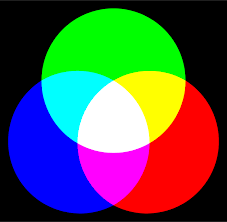

---

## RGBの基本的な使い方
- 赤、緑、青の`rect`を描画

```javascript
function setup() {
  createCanvas(400, 400);
  background(255);
  noStroke();
  rectMode(CENTER);
  fill(255, 0, 0);
  rect(100, height/2, 80, 80);
  fill(0, 255, 0);
  rect(200, height/2, 80, 80);
  fill(0, 0, 255);
  rect(300, height/2, 80, 80);
}
```


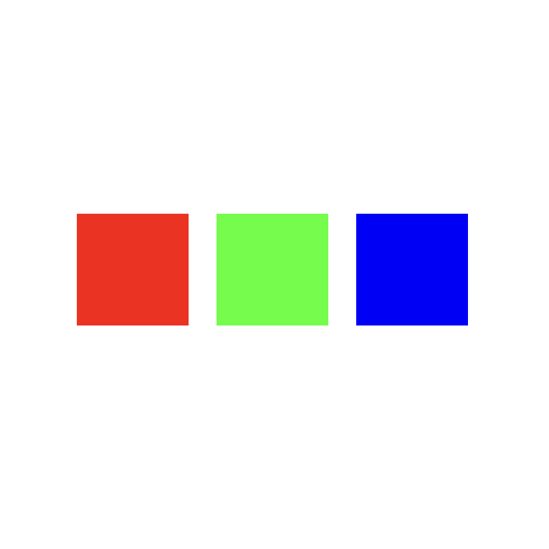


---

## 透明度（RGBA）で重なりを表現する

- 第4引数で透明度（Alpha値）を指定
- 値が小さいほど透明に（0〜255の範囲）
- 図形同士の重なりが見えるようになる

```javascript
function setup() {
  createCanvas(400, 400);
  background(255);
  noStroke();
  fill(255, 0, 0, 150);
  ellipse(150, 200, 200);
  fill(0, 0, 255, 150);
  ellipse(250, 200, 200);
}
```

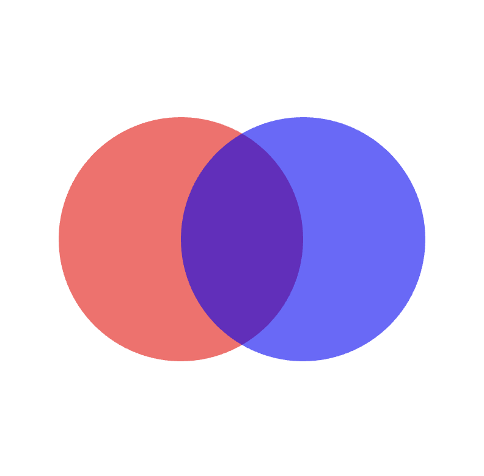

---

## RGBでランダムな配色を作る

```javascript
function setup() {
  createCanvas(800, 400);
  background(0);
  noStroke();
  for (let i = 0; i < 200; i++) {
    fill(random(255), random(255), random(255), 200);
    ellipse(random(width), random(height), random(20, 60));
  }
}
```

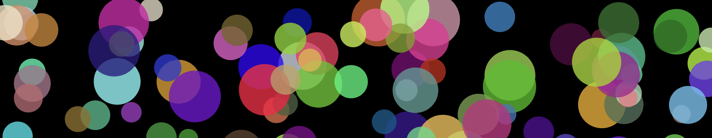

---

# HSBモードでの色の指定

---

## HSB


- **Hue（色相）**：色味（0〜360°）
  - カラーホイール（色相環）の角度を指定
  - 例：赤=0°, 緑=120°, 青=240°
- **Saturation（彩度）**：鮮やかさ（0〜100）
  - 0付近=淡い色、100付近=はっきりした色
- **Brightness（明度）**：明るさ（0〜100）
  - 0で黒、100でその色の最も明るい状態  

<div class="footer">
  <a href="https://www.dic-color.com/knowledge/business/what_rgb_03.html">参考：<u>―HSLとHSBの色空間構造の違いと彩度調整方法のコツ―</u></a>
</div>

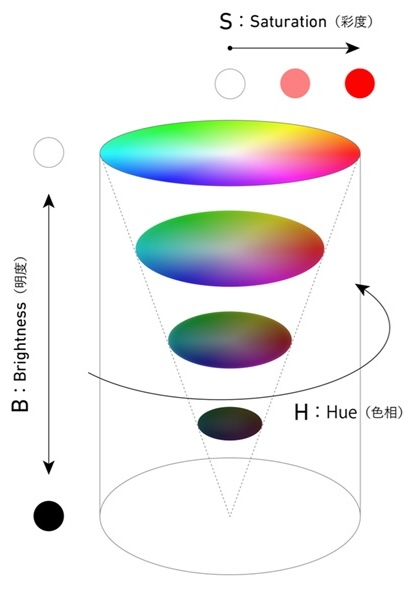

---

## HSBモードの指定

- `colorMode(HSB)`で指定

```javascript
function setup() {
  createCanvas(400, 400);
  colorMode(HSB);
  noStroke();
  for (let i = 0; i < 10; i++) {
    let h = i * 36;
    fill(h, 80, 100);
    rect(i * 40, 0, 40, height);
  }
}
```


---

## 透明度付きのHSBモードを指定

- `colorMode(HSB,360, 100, 100, 100)`で指定

```javascript
function setup() {
  createCanvas(400, 400);
  colorMode(HSB,360, 100, 100, 100);
  noStroke();
  for (let i = 0; i < 10; i++) {
    let h = i * 36;
    fill(h, 80, 100, 50);//透明度50%
    rect(i * 40, 0, 40, height);
  }
}
```

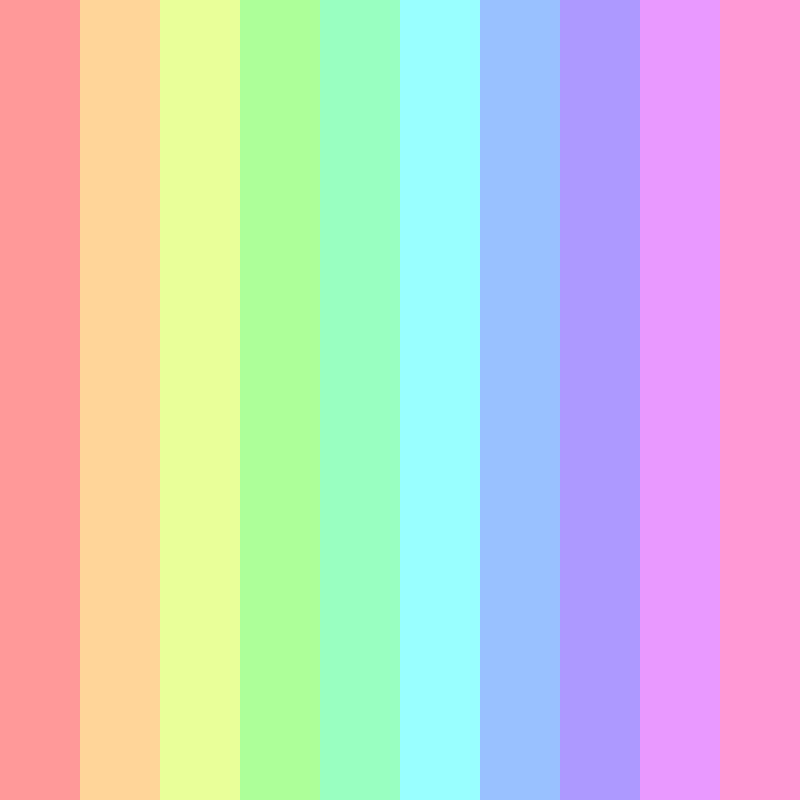

---

## HSBで滑らかな色の変化を作る

- `map()` ：値を別の範囲に変換
- `map(value, start1, stop1, start2, stop2)`

```javascript
function setup() {
  createCanvas(400, 400);
  colorMode(HSB, 360, 100, 100);
  noStroke();
  for (let x = 0; x < width; x++) {
    //キャンバス幅の値を0~360(hue値)に変換
    let h = map(x, 0, width, 0, 360);
    stroke(h, 80, 100);
    line(x, 0, x, height);
  }
}
```

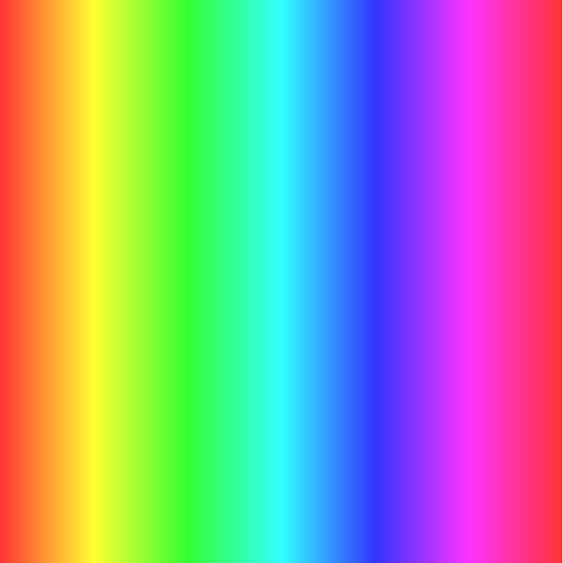

---

## 色相,彩度,明度をランダムに変える

- `random()`で色相の範囲を指定して、統一感のある配色に

```javascript
function setup() {
  createCanvas(400, 400);
  colorMode(HSB, 360, 100, 100, 100);
  noStroke();
  background(0, 0, 15);
  for (let i = 0; i < 100; i++) {
    let h = random(200, 260); // 青〜紫系で統一感
    fill(h, random(40, 100), random(60, 100));
    ellipse(random(width), random(height), random(10, 50));
  }
}
```


---

## 彩度, 明度でトーンを統一する

- **トーン(色調)**：
  彩度と明度による明暗・濃淡のグループ
- トーンを統一することで、調和した配色に
- トーンの設定イメージ
  - **ビビッド**：`彩度 = 100`, `明度 = 100`  
  - **ソフト**：`彩度 = 50`, `明度 = 70`  
  - **ダーク**：`彩度 = 50`, `明度 = 30`  


<div class="footer">
  <a href="https://zokeifile.musabi.ac.jp/%E8%89%B2%E8%AA%BF/">参考：<u>武蔵野美術大学 造形ファイル</u></a>
</div>

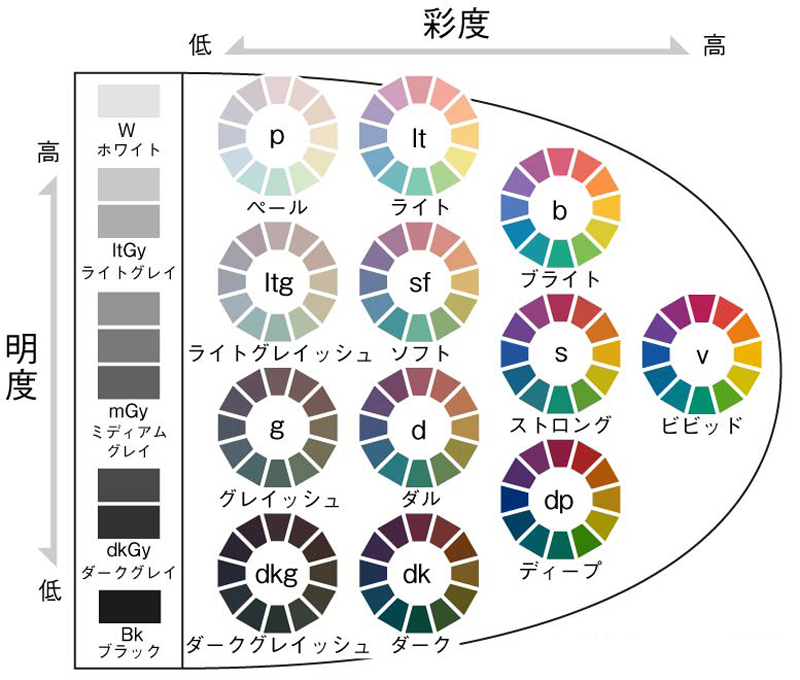

---

## トーンを揃えた描画

```javascript
function setup() {
  createCanvas(400, 400);
  colorMode(HSB, 360, 100, 100, 100);
  noStroke();
  background(255);
  for (let i = 0; i < 150; i++) {
    let h = random(0, 360); // ランダムな色相
    fill(h, 50, 70); //ソフトなトーンに
    ellipse(random(width),random(height),random(10, 50));
  }
}
```

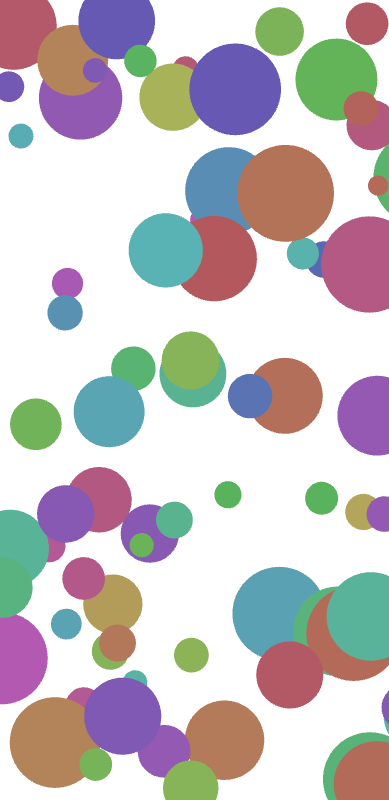

---

## 補色を使う

- 基準色の **180°反対側** の色（補色）を使うと、**強いコントラスト**に

```javascript
let Hue = [];
function setup() {
  createCanvas(400, 400);
  colorMode(HSB, 360, 100, 100);
  noStroke();
  Hue[0] = 100; // 基準色
  Hue[1] = (Hue[0] + 180) % 360;

  background(0, 0, 95);
  for (let i = 0; i < 100; i++) {
    let h = Hue[int(random(2))];
    fill(h, 80, 100);
    rect(random(width), random(height), random(10, 50));
  }
}
```


---

## トライアドを使う

- **カラーホイール上で120°ずつ離れた3色**を使うと、調和しつつも変化のある配色に

```javascript
// （前のコードのHueの設定から）
  Hue[0] = 100; // 基準色
  Hue[1] = (Hue[0] + 120) % 360; // トライアド1
  Hue[2] = (Hue[0] + 240) % 360; // トライアド2
  background(0, 0, 95);
  for (let i = 0; i < 100; i++) {
    let h = Hue[int(random(3))]; // 三色をランダムに選択
    fill(h, 80, 100);
    rect(random(width), random(height), random(10, 50));
  }
...
```

---

## HSBを使った色相の可視化応用

- **色相 (Hue)** を変化させることで、カテゴリ・連続変数・時系列データの違いを直感的に示せる  
- 可視化でよく使われる例：  
  - 極座標ヒートマップ：色相を角度／時間にマッピング  
  - 散布図でカテゴリを色相で区別  
  - 時系列グラフで時間経過を色相の変化で表現  

---

# カラーコードによる配色

---

## カラーコードとは？

- Webなどで使われる **16進数表記の色指定**
- RGB値を16進に変換したもの  
- 例：
  - `#FF0000` → 赤
  - `#00FF00` → 緑
  - `#0000FF` → 青  

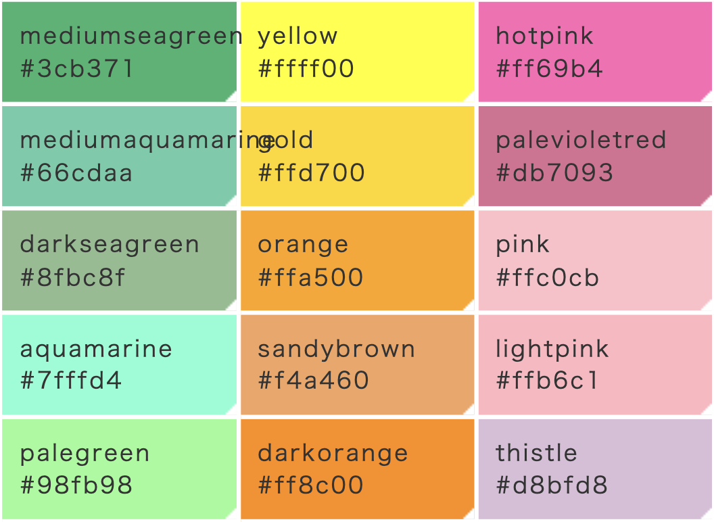

---

## カラーコードを使う例

- string型で色の引数として利用
- 例：`background("#FFFFFF"`) = 白背景

```javascript
function setup() {
  createCanvas(400, 400);
  background("#FFFFFF");
  noStroke();
  fill("#FF595E");
  ellipse(100, height/2, 80);
  fill("#1982C4");
  ellipse(200, height/2, 80);
  fill("#6A4C93");
  ellipse(300, height/2, 80);
}
```

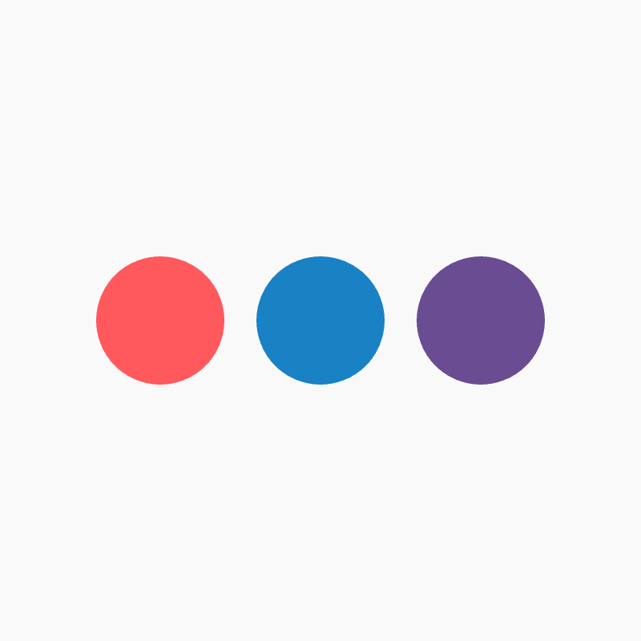

---

## 複数色をまとめたカラーパレット

- 配列にカラーコードをまとめて指定
- 色のパターンを固定してランダムに

```javascript
let palette = ["#FF595E", "#FFCA3A", "#8AC926", "#1982C4", "#6A4C93"];
function setup() {
  createCanvas(800, 800);
  background("#F9F9F9");
  noStroke();
  for (let i = 0; i < 200; i++) {
    fill(random(palette));
    ellipse(random(width), random(height), random(20, 60));
  }
}
```

<!-- 
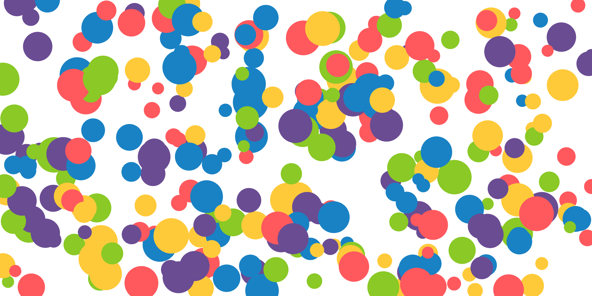 -->

---

## 透明度の指定

- カラーコードに透明度は入れられないので`setAlpha()`を使う
- `color()`関数に色を指定した上で，`setAlpha(100)`で指定

```javascript
let palette = ["#FF595E", "#FFCA3A", "#8AC926", "#1982C4", "#6A4C93"];
function setup() {
  createCanvas(800, 800);
  background("#F9F9F9");
  noStroke();
  for (let i = 0; i < 200; i++) {
    col = color(random(palette));
    col.setAlpha(random(255));
    fill(col);
    ellipse(random(width), random(height), random(20, 60));
  }
}
```


---

## 例：4色で統一したデザイン

- 図形に3色 + 背景1色(ライトグリーン)で4色のパターンの例

```javascript
let colors = ["#2E86AB", "#F6C667", "#E63946"];
function setup() {
  createCanvas(800, 800);
  noStroke();
  background("#F1FAEE");
  for (let i = 0; i < 400; i++) {
    fill(random(colors));
    rect(random(width), random(height), random(10, 50));
  }
}
```

---

## 例：4色で統一したデザイン + 図形の透明度指定

```javascript
let colors = ["#64A891", "#B5DAE1", "#F2EA83"];
function setup() {
  createCanvas(800, 800);
  background("#6C549B");
  noStroke();
  for (let i = 0; i < 400; i++) {
    col = color(random(colors));
    col.setAlpha(random(50, 255));
    fill(col);
    ellipse(random(width), random(height), random(10, 50));
  }
}
```


---

# 応用：グラデーション表現

---

## 彩度や明度を操作して印象を変える

```javascript
function setup() {
  createCanvas(400, 400);
  colorMode(HSB, 360, 100, 100);
  noStroke();
  for (let y = 0; y < height; y++) {
    let s = map(y, 0, height, 0, 100);
    fill(200, s, 100); // 彩度だけを変化
    rect(0, y, width, 1);
  }
}
```

---

## lerp()とは？

- **linear interpolation（線形補間）** の略  
- 2つの値の間を割合で求める関数（第1引数,第2引数の間の値を第3引数で指定）
- `lerp(start, stop, amount)`  
  - `start`: 開始値  
  - `stop`: 終了値  
  - `amount`: 補間割合（0〜1）

```javascript
let a = lerp(0, 10, 0.5); // → 5
let b = lerp(0, 10, 0.2); // → 2
```

---

## lerp()の利用例

- 「0」と「100」の間を割合で進む  
- `amt = 0` → 開始値、`amt = 1` → 終了値  
- 中間の`0.5`ならちょうど真ん中

```javascript
function setup() {
  createCanvas(400, 100);
  background(255);
  strokeWeight(6);
  line(50, 50, 350, 50);
  let x = lerp(50, 350, 0.5);
  stroke(255, 0, 0);
  point(x, 50);
}
```

---

## lerp()を繰り返して使う

- 数値や位置、サイズをなめらかに変化させる

```javascript
function setup() {
  createCanvas(400, 600);
  background(255);
  noStroke();
  for (let i = 0; i < 20; i++) {
    let y = lerp(100, height - 150, i / 19);  // 縦方向の位置
    let s = lerp(20, 200, i / 19);  // サイズ
    let r = lerp(50, 255, i / 19);  // 赤みが増す
    let a = lerp(0, 100, i / 19);  // 透明→不透明へ
    fill(r, 100, 100, a);
    ellipse(width / 2, y, s);
  }
}
```

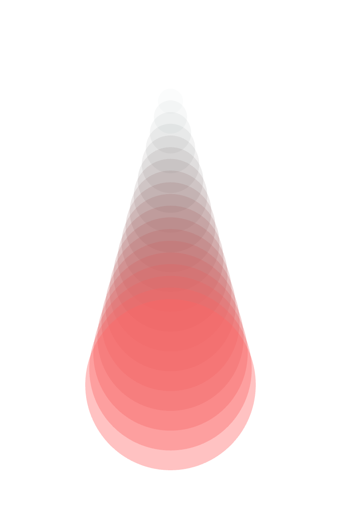

---

## lerpColor()で色を補間したグラデーション


```javascript
function setup() {
  createCanvas(400, 400);
  noStroke();
  let c1 = color(255, 100, 100);
  let c2 = color(100, 100, 255);
  for (let i = 0; i < width; i++) {
    let inter = map(i, 0, width, 0, 1);
    let c = lerpColor(c1, c2, inter);
    stroke(c);
    line(i, 0, i, height);
  }
}
```


---

## 演習：制作したグラフィックを画像として保存する

---

## 画像を書き出す

- `saveCanvas()` を使うと、作品を画像として保存できる  
- 第1引数で**ファイル名**、第2引数で**形式**（"png"など）を指定  

```javascript
function setup() {
  createCanvas(400, 400);
  background(240);
  noStroke();
  for (let i = 0; i < 100; i++) {
    fill(random(255), random(255), random(255));
    ellipse(random(width), random(height), random(20, 60));
  }
}

function mousePressed() {
  saveCanvas("my_graphic", "png"); //クリックで保存
}
```
---

## 目的に合わせたキャンバスサイズの指定

- **出力先に合わせてキャンバスサイズを設定する**  
  - SNS投稿：`1080×1080`  
  - スマホ壁紙：`1080×1920`  
  - ポスターA4(300dpi)：`2480×3508`
  - ポスターA4(150dpi)：`1240×1754`

```javascript
createCanvas(1080, 1920); // スマホサイズの指定
background("#F5F5F5");
```

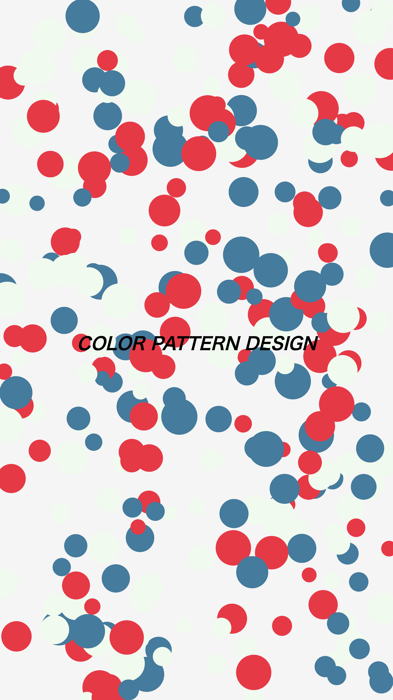

<div class="footer">
  <a>* dpi（dots per inch）：解像度のこと。1inchあたりのドット数</a>
</div>


---

## 例：スマホ壁紙サイズの描画（3色パターンのデザイン）

```javascript
function setup() {
  createCanvas(1080, 1920);
  background("#F5F5F5");
  noStroke();
  for (let i = 0; i < 300; i++) {
    fill(random(["#E63946", "#F1FAEE", "#457B9D"]));
    ellipse(random(width), random(height), random(40, 100));
  }
  fill(0);
  textAlign(CENTER); textStyle(BOLDITALIC); textSize(48);
  text("COLOR PATTERN DESIGN", width/2, height/2);
}

function mousePressed(){
  saveCanvas("Poster_Image","png") // キャンバスをクリックで画像を保存
}
```

---

## 例：16:9の横長のパターン（PCの壁紙やスライドの背景）

```javascript
function setup() {
  createCanvas(1600, 900); // 比率が16:9のキャンバスサイズ
  background("#F5EFE7");
  noStroke();
  for (let i = 0; i < 300; i++) {
    fill(random(["#13579D", "#4DB2D0", "#DC6FA7"]));
    ellipse(random(width), random(height), random(40, 100));
  }
  fill(0);
  textAlign(CENTER); textStyle(BOLDITALIC); textSize(48);
  text("COLOR PATTERN DESIGN", width/2, height/2);
}

function mousePressed(){
  saveCanvas("Poster_Image","png") // キャンバスをクリックで画像を保存
}
```

---

## 例：グラデーション背景とランダムな描画を組み合わせる

```javascript
function setup() {
  createCanvas(1240, 1754);//A4(150dpi)
  let c1 = color("#FF9A8B"); let c2 = color("#8AC6FF");
  for (let y = 0; y < height; y++) {
    let inter = map(y, 0, height, 0, 1);
    stroke(lerpColor(c1, c2, inter));
    line(0, y, width, y);
  }
  noStroke(); fill("#F9F9F9");
  for (let i = 0; i < 150; i++) {
    ellipse(random(width), random(height), random(20, 60));
  }
}

function mousePressed(){
  saveCanvas("Gradiation_Poster","png");
}
```

---

## 例：半透明になるグラデーションの背景

```javascript
function setup() {
  createCanvas(1240, 1754); background(255);
  c1 = color("#FF9A8B"); c2 = color("#FF9A8B"); c2.setAlpha(0); //透明度0の同色
  const headerH = height * 0.4; // 上から40%をグラデーションに
  for (let y = 0; y < headerH; y++) {
    let inter = map(y, 0, headerH, 0, 1);
    stroke(lerpColor(c1, c2, inter));
    line(0, y, width, y);
  }
  noStroke(); fill(255);
  for (let i = 0; i < 150; i++) {
    ellipse(random(width), random(headerH), random(20, 60));
  }
}
function mousePressed(){
  saveCanvas("Gradiation_Poster","png");
}
```

---

## 例：図形の描画位置によって透明度を変える
```javascript
function setup() {
  createCanvas(1240, 1754);//A4(150dpi)
  background("#f8edea"); noStroke();
  rectMode(CENTER);
  colors = ["#bcd4e2","#518bb3","#053351"]; // 青ベースの配色
  for (let i = 0; i < 300; i++) {
    col = color(random(colors));
    let x = random(width); let y = random(height);
    Alpha = map(y, 0, height, 200, -50);// 下の位置での描画になるほど透明に
    col.setAlpha(Alpha);
    fill(col);
    ellipse(x, y, random(5, 100));
  }
}
function mousePressed(){
  saveCanvas("Gradiation_Object","png");
}
```

---


# まとめ

- **RGBモード**：光の三原色。数値で正確に指定  
- **HSBモード**：色味・鮮やかさ・明るさを直感的に調整  
- **カラーコード**：デザインやWebと親和性が高い色の値
- **配色パターン**：Hueの範囲やカラーコードの限定による色の限定
- **グラデーション表現**：図形やキャンバス全体で滑らかな色のつながりを作る

---

## カラーデザインの参考サイト

---

## カラーパターンの参考(2色パターン):[Pigment](https://pigment.shapefactory.co/)

- Pigment=顔料・インクのことで、鮮やかで強い色のパターンが作れる

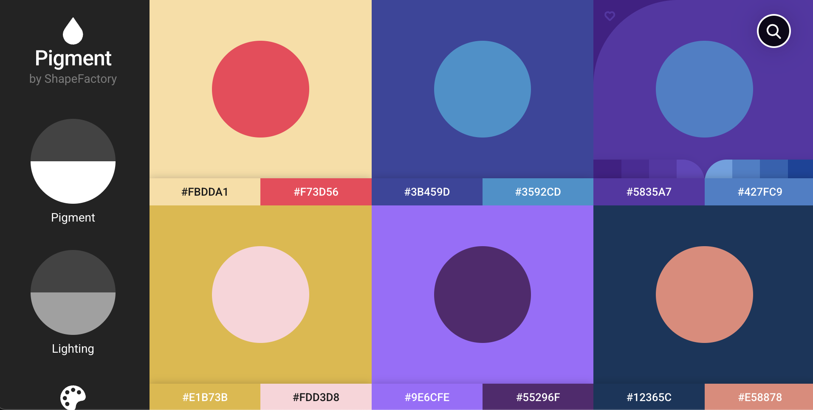

---

## カラーパターンの参考:[COOLORS](https://coolors.co/)

- ベースカラーを指定してカラーパターンを提案してくれるサイト

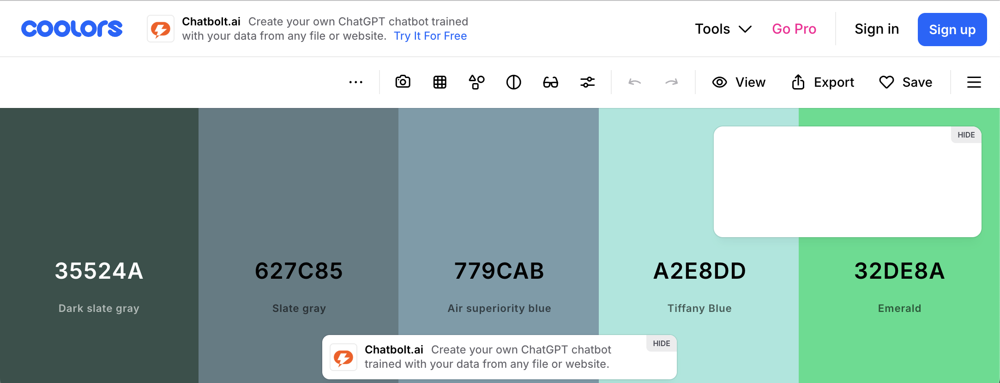