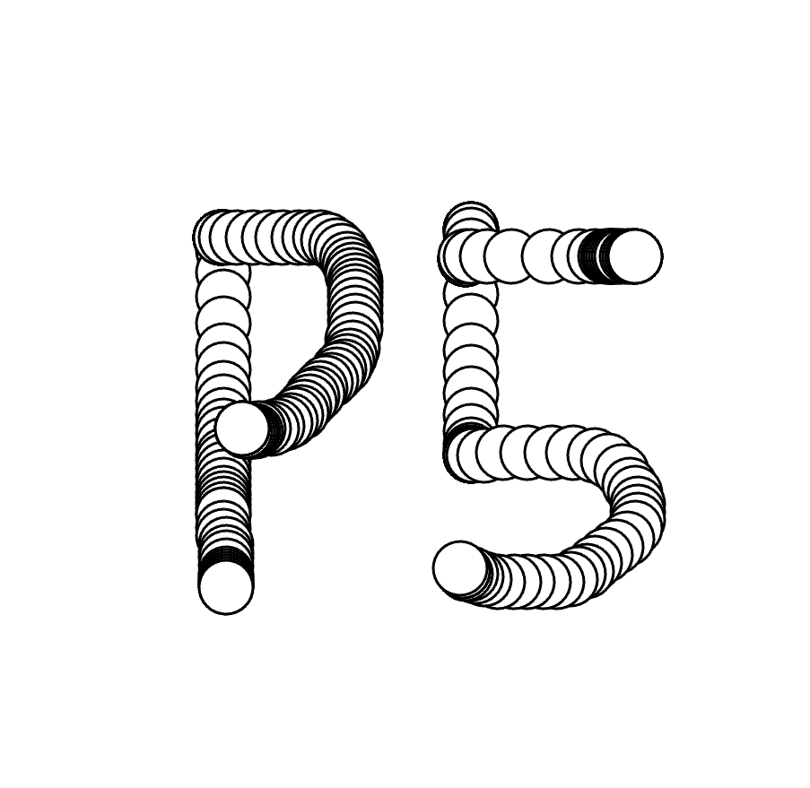
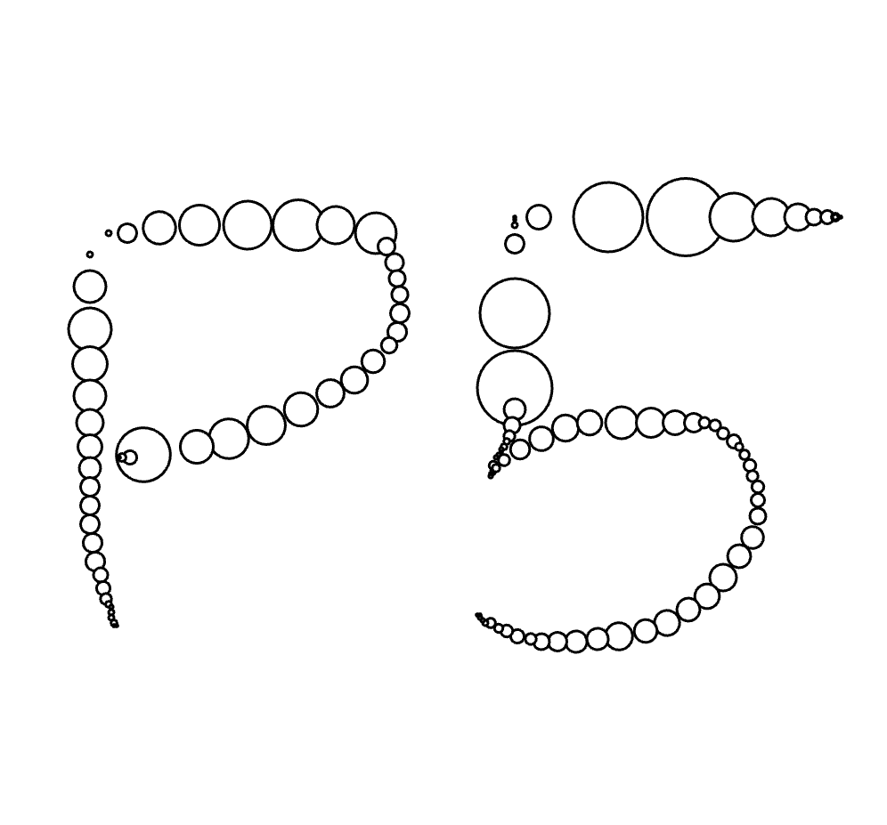

<!-- _unsafe: true -->
<style>
.center-img {
  display: block;
  margin: 0 auto;
}
</style>

# 第3回 クリエイティブ・コーディング入門  
## クラスを使ったアニメーション

---

## 今日の内容

- パーティクルの生成
  - クラスでパーティクルを定義
  - 生成 → 動き → 消える流れ  
- パーティクルの動きと印象
  - ゆっくり動く／速く動く表現の違い
  - 操作感・インタラクションへの影響
- 応用：マウスを使ったインタラクション
  - `mouseX`, `mouseY` で位置に応じた描画
  - `dist()` を使ったサイズ・色の変化  

---


# パーティクルによるアニメーション

---

## [キャンバスを自由に動くパーティクル](https://editor.p5js.org/takano_ma/sketches/PZPhxKah6)（←サンプルコード）

- たくさんの「粒（particle）」による描画表現
  - ellipseを複数描画し、自律的に動かす
- 専用のクラスを用意して、複数のインスタンスを配列に追加する
- パーティクルクラスに必要な要素
  - 位置（position）
  - 速度（velocity）

---

## パーティクルのクラスを作る

1. クラスの定義：パーティクルの雛形を作る（`class Particle { ... }` ）
2. クラスの初期設定：`constructor()` で初期位置や速度を設定する
3. `update()` で毎フレーム位置を更新する
4. `display()` で描画する
5. 配列 `particles[]` にたくさん入れて、`for` で回す

---

# パーティクルクラスの初期設定

- `constructor()`を用意して初期設定の準備
- インスタンスを作成時に受け取った引数を、初期値としてプロパティに保存
- `this.`で、各インスタンスごとに固有のプロパティを定義できる

```javascript
class Particle{
  constructor(x, y){ //引数で生成位置を受け取る
    this.x = x; // x座標
    this.y = y; // y座標
    this.vx = random(-1, 1); //x方向の速度
    this.vy = random(-1, 1); //y方向の速度
    this.e_size = random(5, 20); //パーティクルの大きさ
  }
}
```

---

# パーティクルの動きを表現するメソッドを作成
- `update()`でパーティクルの位置や寿命など、毎フレームの状態変化を処理
- vx,vy を速度（x方向・y方向の移動量）として位置に加算し、移動させる
- キャンバスの両端に来たら移動方向を反転させる

```javascript
  /* constructorの後に追加 */
  update() {
      if(this.x > width || this.x <= 0){
        this.vx *= -1; //端に来たら逆方向の移動に
      }
      if(this.y > height || this.y <= 0){
        this.vy *= -1; //端に来たら逆方向の移動に
      }
      this.x += this.vx;
      this.y += this.vy;
  }
```

---

# パーティクルを描画するメソッドを作成
- `display()`を作成し、パーティクルの描画処理を記述

```javascript
  /* update() の後に追加 */
  display() {
    noStroke();
    fill(255);
    ellipse(this.x, this.y, this.e_size);
  }
```

---

## 配列にインスタンスを作成
- 配列を用意し、`setup()`の中でパーティクルのインスタンスを追加する
  - 配列には`配列名.push()`で要素を追加できる
  - `new クラス名(引数)`でインスタンスを作成

```javascript
let particles = []; //パーティクル用の配列
let num = 200; //生成する個数を指定

function setup() {
  createCanvas(windowWidth, windowHeight);
  // for文でnum個のパーティクルのインスタンスを配列に追加
  for(let i = 0; i < num; i++){
    particles.push(new Particle(random(width),random(height)));  
  }
}
```

---

## パーティクルの描画

- `draw()`内で、、配列に入っている各パーティクルに対して描画処理を行う
  - for文でパーティクルのインスタンスを順に取り出す
  - `update()`で位置を更新し、`display()`で描画する

```javascript
function draw() {
  background(0);
  for (let p of particles) {
    p.update();
    p.display();
  }
}
```

基本的なパーティクルの表現がこれで完成 


---

# パーティクルに寿命をつける

---

## [消えていくパーティクル生成](https://editor.p5js.org/takano_ma/sketches/BzEhtzl3e) （←サンプルコード） 

- 先ほどのコードをアレンジして、逐次生成されては消えるパーティクルに
  - `draw()`内でインスタンスを毎フレーム作成する
- 各パーティクルの要素に「lifespan」が加わる
  - 位置（position）
  - 速度（velocity）
  - **寿命（lifespan）** ← 新たなプロパティとして追加
  
---

## パーティクルのクラスを作る(lifespan有り)

1. クラスの定義：パーティクルの雛形を作る（`class Particle { ... }` ）
2. クラスの初期設定：`constructor()` で初期位置や速度、寿命を設定
3. `update()` で毎フレーム位置や寿命を更新
4. `display()` で描画
5. `draw()`無いで `particles[]`にインスタンスを毎フレーム追加 (**new**)
6. `lifespan`が0になった要素を配列から削除する(**new**)

---

# パーティクルクラスの初期設定

- `constructor()`の中に`lifespan`のプロパティを追加
  - 初期値を255に設定し、アルファ値（透明度）として利用する
  - 更新時に毎フレーム 1 ずつ減らし、0 以下になったら削除判定に使う

```javascript
class Particle{
  constructor(x, y){
    this.x = x;
    this.y = y;
    this.vx = random(-1, 1);
    this.vy = random(-1, 1);
    this.e_size = random(5, 20);
    this.lifespan = 255; // 追加：寿命と透明度を兼ねるプロパティ
  }
}
```

---

# パーティクルの動きを表現するメソッドを作成
- `update()`メソッドに、寿命（lifespan）を更新する処理を追加する
- `lifespan`を毎フレーム減らし、時間経過とともに薄くなって消えるようにする

```javascript
  /* constructorの後に追加 */
  update() {
      this.x += this.vx;
      this.y += this.vy;
      this.lifespan -= 1; // 追加：寿命(透明度)を減らしていく
  }
```

---

# パーティクルを描画するメソッドを作成
- `display()`メソッドで`fill()`のアルファ値にlifespanを反映させる
  - 寿命に応じて徐々に透明になっていくようにする

```javascript
  /* update() の後に追加 */
  display() {
    noStroke();
    fill(255, this.lifespan); // 追加：lifespanを透明度として利用
    ellipse(this.x, this.y, this.e_size);
  }
```

---

# パーティクルを削除するためのメソッドを追加
- `isDead()`を作成し、`lifespan`が0以下になったら`true`を返すようにする
  - 描画ループの中で寿命切れを判定するために使うメソッド

```javascript
  /* display() の後に追加 */
  isDead() {
    return this.lifespan <= 0;
  }
```

---

## パーティクルを動かすメイン部分

- 今回は`draw()`内で、毎フレーム新しいインスタンスを配列に追加する
  - ここでは、初期位置として`(width/2, height/2)`を指定 
  - 毎フレーム、中心からパーティクルが生まれて広がっていく表現に

```javascript
let particles = [];

function setup() {
  createCanvas(windowWidth, windowHeight);
}

function draw() {
  background(0);
  particles.push(new Particle(width/2,height/2));//初期位置をキャンバス中央に
  for (let p of particles) {/*updateとdisplay*/} 
// 続きは次のページ
```

---

## 寿命を判断し、配列から要素を削除していく

- `isDead`が`true`（lifespan が 0 以下）になったかどうかを判定する
- `true`であれば、`splice()`を使って配列からそのパーティクルを削除する
  - `splice(i,1)`は「i 番目の要素を 1 つ削除する」という処理
```javascript
function draw() {
    /*中略*/
    for (let i = particles.length - 1; i >= 0; i--) {
    if (particles[i].isDead()) {
      particles.splice(i, 1);
    }
  }
}
```

---

# 応用：マウスに反応するパーティクル

---

## [マウス位置からパーティクルを出す](https://editor.p5js.org/takano_ma/sketches/nBo9cSMmE)

- `mouseX`,`mouseY`で、常に更新されるマウスの位置を取得できる
  - 新しいインスタンスを作る際、その位置を初期値として利用する

```javascript
function draw(){
  background(0);
  particles.push(new Particle(mouseX, mouseY));  

  /*以下省略*/ 
}
```

---

## [クリック中のみパーティクルを出す](https://editor.p5js.org/takano_ma/sketches/nBo9cSMmE)

- `mouseIsPressed`でクリックの状態をブール値で取得
  - クリック中のみ描画するようにできる

```javascript
function draw() {
  background(0);

  if(mouseIsPressed){
    particles.push(new Particle(mouseX, mouseY));  
  }
  /*以下省略*/ 
}
```


---

## マウスの動きを検出する処理を加える

- `pre_x`, `pre_y`を用意して前フレームのマウスの位置を保存
- `dist(mouseX, mouseY, pre_x, pre_y)` で移動距離(px)を計算
- ある程度移動したらインスタンスを作成するようにする

---

## [マウスが動いている時にパーティクルを生成](https://editor.p5js.org/takano_ma/sketches/0ImvPHeKY)

```javascript
let pre_x = 0, pre_y = 0;

function draw() {
  background(0);

  let distance = dist(mouseX, mouseY, pre_x, pre_y);
  if(distance > 10){
    particles.push(new Particle(mouseX, mouseY));  
  }
  pre_x = mouseX;
  pre_y = mouseY;

  /*以下省略*/ 
}
```

---

# 4. パーティクルの動きと印象の違い

---

## 動き方による印象の違い

- **ゆっくり・なめらか**な動き
  - 落ち着いた・やわらかい・幻想的
  - バックグラウンドや待機画面などに向いている
- **速く・激しい**動き
  - 元気・緊張感・エネルギッシュ
  - ゲームのエフェクトやアラート表現に向いている
- 速度だけでなく
  - 軌道（まっすぐ / ジグザグ / ランダムウォーク）
  - 重力や風（加速度）の有無  
  も印象を大きく変える

---

## 例1：ゆっくり漂うパーティクル

- 下方向にゆっくり落ちる → 「ふわっとした」印象

```javascript
let particlesSlow = [];

class SlowParticle {
  constructor() {
    this.x = random(width);
    this.y = random(-50, 0);
    this.vx = random(-0.3, 0.3);
    this.vy = random(0.2, 0.8);
    this.size = random(10, 30);
  }

  update() {
    this.x += this.vx;
    this.y += this.vy;
    if (this.y > height + 20) {
      this.y = random(-50, 0);
      this.x = random(width);
    }
  }

  display() {
    noStroke();
    fill(200, 230, 255, 180);
    ellipse(this.x, this.y, this.size);
  }
}

function setup() {
  createCanvas(600, 400);
  for (let i = 0; i < 60; i++) {
    particlesSlow.push(new SlowParticle());
  }
}

function draw() {
  background(10, 20, 40);
  for (let p of particlesSlow) {
    p.update();
    p.display();
  }
}
```

---

## 例2：すばやく弾けるパーティクル

- 急に飛び出してすぐ消える → アクションや爆発のような印象

```javascript
let burst = [];

class BurstParticle {
  constructor(x, y) {
    this.x = x;
    this.y = y;
    let angle = random(TWO_PI);
    let speed = random(3, 8);
    this.vx = cos(angle) * speed;
    this.vy = sin(angle) * speed;
    this.life = 255;
  }

  update() {
    this.x += this.vx;
    this.y += this.vy;
    this.life -= 10;
  }

  display() {
    noStroke();
    fill(255, 200, 50, this.life);
    ellipse(this.x, this.y, 6);
  }

  isDead() {
    return this.life <= 0;
  }
}

function mousePressed() {
  // クリックした場所から一気に噴き出す
  for (let i = 0; i < 80; i++) {
    burst.push(new BurstParticle(mouseX, mouseY));
  }
}

function draw() {
  background(0);
  for (let p of burst) {
    p.update();
    p.display();
  }

  for (let i = burst.length - 1; i >= 0; i--) {
    if (burst[i].isDead()) {
      burst.splice(i, 1);
    }
  }
}
```

---

# まとめ

- マウス座標（`mouseX`, `mouseY`）や `dist()` を使うと  
  → 位置に応じたインタラクション表現ができる
- パーティクルは
  - 「位置・速度・寿命」を持つ小さな点の集合
  - クラスと配列で管理すると扱いやすい
- 動きのパラメータ（速度・方向・重力など）を変えることで
  - 「落ち着いた」「激しい」「軽い」「重い」など  
    インターフェースの印象をコントロールできる

---

## 演習

1. マウスの動きに応じて  
   - 大きさ・色・透明度が変わる「ブラシ」を作る  
2. パーティクルクラスを使って  
   - マウスクリックで噴き出すエフェクトをデザインする  
3. 動きのパラメータ（速度・重力・寿命など）を変えて  
   - 「落ち着いた」「激しい」など、印象が変わるパターンを2種類以上つくる  


---


# マウスを使った描画

---

## マウス座標で図形を描く

- p5.js では、キャンバス内のマウス位置を取得できる
  - `mouseX`：マウスのX座標
  - `mouseY`：マウスのY座標 
- `draw()` 内で `ellipse(mouseX, mouseY, ...)` とすると、マウスカーソルに追従した円を描くことができる（簡易的な「絵かきツール」になる）
- `mouseIsPressed`でクリック状態をブール値で取得できる

---

## 例：マウスクリックで描画

```javascript
function setup() {
  createCanvas(600, 400);
  background(255);
}

function draw() {
  if (mouseIsPressed) {
    ellipse(mouseX, mouseY, 20);
  }
}
```




---

## 距離 `dist()` を使ったインタラクション

- `dist(x1, y1, x2, y2)`：2点間の距離を返す関数
  

---

## 例：マウスの速度で円の大きさを変える

```javascript
let previous_x, previous_y;

function setup() {
  createCanvas(600, 400);
  background(255);
}

function draw() {
  if (mouseIsPressed) {
    //マウスの移動距離を円の直径に反映
    let diameter = dist(mouseX, mouseY, previous_x, previous_y);
    ellipse(mouseX, mouseY, diameter);
  }
  //前フレームのマウスの位置情報を保存
  previous_x = mouseX;
  previous_y = mouseY;
}
```



---

# 補足：windowresizeによるキャンバスサイズの更新


---

# fullscreenの利用

- keypressed関数を使う
- key == f などで特定のキー入力を処理を紐付け


---

