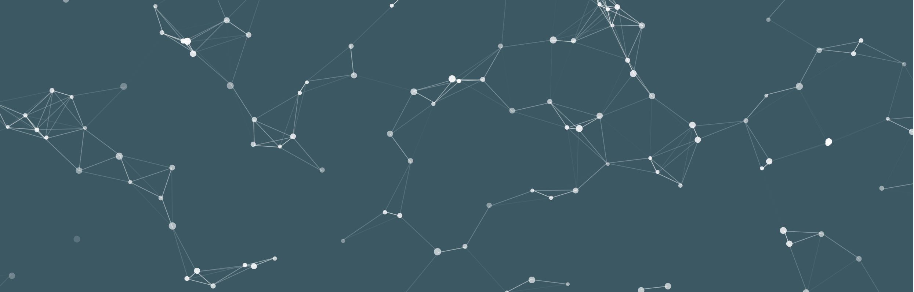
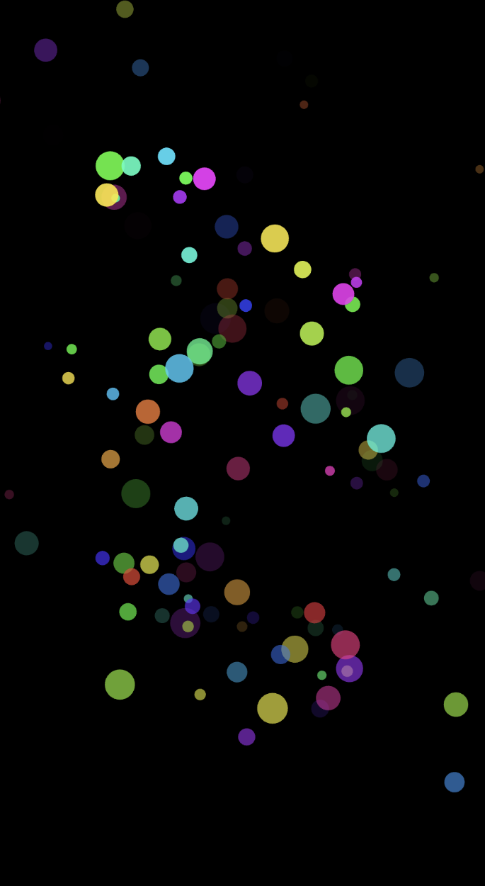
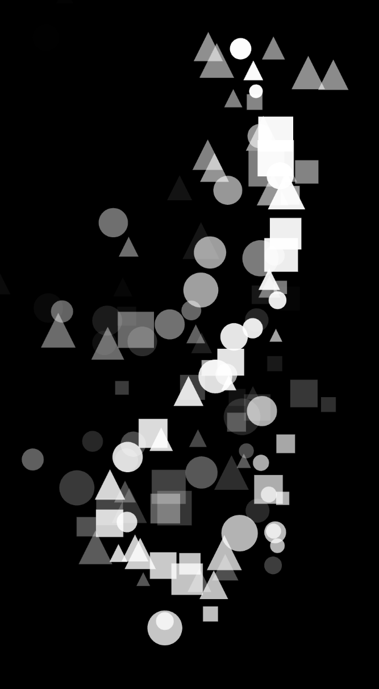
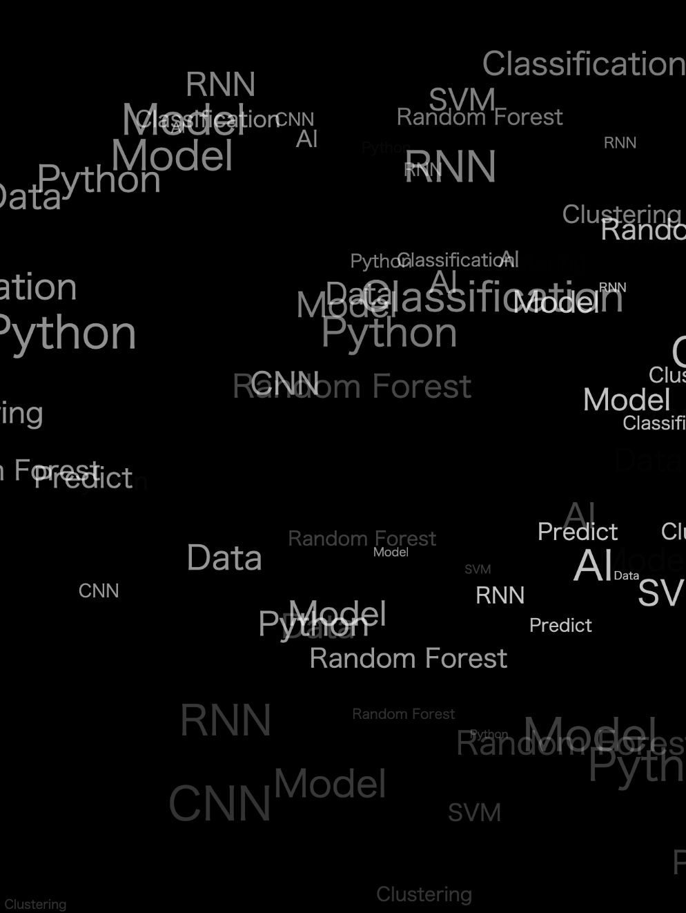
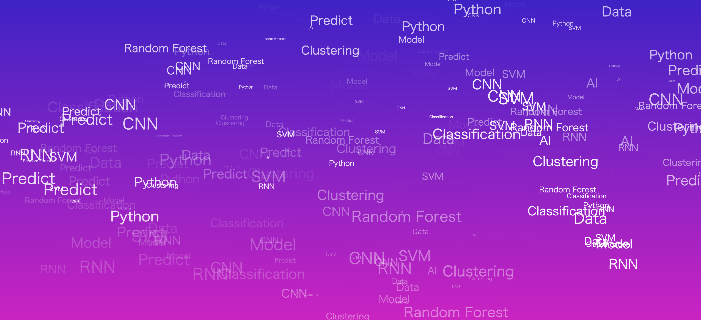

<!-- _unsafe: true -->
<style>
.center-img {
  display: block;
  margin: 0 auto;
}
</style>

# 第3回 クリエイティブ・コーディング入門  
## クラスを使ったアニメーション

---

## 今日の内容

- パーティクルの生成
  - クラスでパーティクルを定義
  - 自律的に動くパーティクルの設計
  - 生成されては消えていくパーティクルの設計
- 応用：マウスを使ったインタラクション
  - `mouseX`, `mouseY` で位置に応じた描画
  - `mouseIsPressed`を使ってクリックを検出
  - `dist()` を使って動きを検出

---


## [パーティクルシステム](https://editor.p5js.org/takano_ma/sketches/kplV6yBAz) （←サンプルプログラム）

- **自律的に動くドット**を生成するする表現
- **ジェネラティブ・アート**やWebサイトでよく使われる表現
  - (サンプルではノードが描かれているが、今回は扱わない)



---


# パーティクルによるアニメーション

---

## [キャンバスを自由に動くパーティクル](https://editor.p5js.org/takano_ma/sketches/PZPhxKah6)（←サンプルコード）

- たくさんの「粒（particle）」による描画表現
  - ellipseを複数描画し、自律的に動かす
- 専用のクラスを用意して、複数のインスタンスを配列に追加する
- パーティクルクラスに必要な要素
  - 位置（position）
  - 速度（velocity）

---

## パーティクルのクラスを作る

1. クラスの定義：パーティクルの雛形を作る（`class Particle { ... }` ）
2. クラスの初期設定：`constructor()` で初期位置や速度を設定する
3. `update()` で毎フレーム位置を更新する
4. `display()` で描画する
5. 配列 `particles[]` にたくさん入れて、`for` で回す

---

## パーティクルクラスの初期設定

- `constructor()`を用意して初期設定の準備
- インスタンスを作成時に受け取った引数を、初期値としてプロパティに保存
- `this.`で、各インスタンスごとに固有のプロパティを定義できる

```javascript
class Particle{
  constructor(x, y){ //引数で生成位置を受け取る
    this.x = x; // x座標
    this.y = y; // y座標
    this.vx = random(-1, 1); //x方向の速度
    this.vy = random(-1, 1); //y方向の速度
    this.e_size = random(5, 20); //パーティクルの大きさ
  }
}
```

---

# パーティクルの動きを表現するメソッドを作成
- `update()`でパーティクルの位置や寿命など、毎フレームの状態変化を処理
- vx,vy を速度（x方向・y方向の移動量）として位置に加算し、移動させる
- キャンバスの両端に来たら移動方向を反転させる

```javascript
  /* constructorの後に追加 */
  update() {
      if(this.x > width || this.x <= 0){
        this.vx *= -1; //端に来たら逆方向の移動に
      }
      if(this.y > height || this.y <= 0){
        this.vy *= -1; //端に来たら逆方向の移動に
      }
      this.x += this.vx;
      this.y += this.vy;
  }
```

---

# パーティクルを描画するメソッドを作成
- `display()`を作成し、パーティクルの描画処理を記述

```javascript
  /* update() の後に追加 */
  display() {
    noStroke();
    fill(255);
    ellipse(this.x, this.y, this.e_size);
  }
```

---

## 配列にインスタンスを作成
- 配列を用意し、`setup()`の中でパーティクルのインスタンスを追加する
  - 配列には`配列名.push()`で要素を追加できる
  - `new クラス名(引数)`でインスタンスを作成

```javascript
let particles = []; //パーティクル用の配列
let num = 200; //生成する個数を指定

function setup() {
  createCanvas(windowWidth, windowHeight);
  // for文でnum個のパーティクルのインスタンスを配列に追加
  for(let i = 0; i < num; i++){
    particles.push(new Particle(random(width),random(height)));  
  }
}
```

---

## パーティクルの描画

- `draw()`内で、、配列に入っている各パーティクルに対して描画処理を行う
  - for文でパーティクルのインスタンスを順に取り出す
  - `update()`で位置を更新し、`display()`で描画する

```javascript
function draw() {
  background(0);
  for (let p of particles) {
    p.update();
    p.display();
  }
}
```

基本的なパーティクルの表現がこれで完成 


---

# パーティクルに寿命をつける

---

## [消えていくパーティクル生成](https://editor.p5js.org/takano_ma/sketches/BzEhtzl3e) （←サンプルコード） 

- 先ほどのコードをアレンジして、逐次生成されては消えるパーティクルに
  - `draw()`内でインスタンスを毎フレーム作成する
- 各パーティクルの要素に「lifespan」が加わる
  - 位置（position）
  - 速度（velocity）
  - **寿命（lifespan）** ← 新たなプロパティとして追加
  
---

## パーティクルのクラスを作る(lifespan有り)

1. クラスの定義：パーティクルの雛形を作る（`class Particle { ... }` ）
2. クラスの初期設定：`constructor()` で初期位置や速度、寿命を設定
3. `update()` で毎フレーム位置や寿命を更新
4. `display()` で描画
5. `draw()`内で `particles[]`にインスタンスを毎フレーム追加 (**new**)
6. `lifespan`が0になった要素を配列から削除する(**new**)

---

# パーティクルクラスの初期設定

- `constructor()`の中に`lifespan`のプロパティを追加
  - 初期値を255に設定し、アルファ値（透明度）として利用する
  - 更新時に毎フレーム 1 ずつ減らし、0 以下になったら削除判定に使う

```javascript
class Particle{
  constructor(x, y){
    this.x = x;
    this.y = y;
    this.vx = random(-1, 1);
    this.vy = random(-1, 1);
    this.e_size = random(5, 20);
    this.lifespan = 255; // 追加：寿命と透明度を兼ねるプロパティ
  }
}
```

---

# パーティクルの動きを表現するメソッドを作成
- `update()`メソッドに、寿命（lifespan）を更新する処理を追加する
- `lifespan`を毎フレーム減らし、時間経過とともに薄くなって消えるようにする

```javascript
  /* constructorの後に追加 */
  update() {
      this.x += this.vx;
      this.y += this.vy;
      this.lifespan -= 1; // 追加：寿命(透明度)を減らしていく
  }
```

---

# パーティクルを描画するメソッドを作成
- `display()`メソッドで`fill()`のアルファ値にlifespanを反映させる
  - 寿命に応じて徐々に透明になっていくようにする

```javascript
  /* update() の後に追加 */
  display() {
    noStroke();
    fill(255, this.lifespan); // 追加：lifespanを透明度として利用
    ellipse(this.x, this.y, this.e_size);
  }
```

---

# パーティクルを削除するためのメソッドを追加
- `isDead()`を作成し、`lifespan`が0以下になったら`true`を返すようにする
  - 描画ループの中で寿命切れを判定するために使うメソッド

```javascript
  /* display() の後に追加 */
  isDead() {
    return this.lifespan <= 0;
  }
```

---

## パーティクルを動かすメイン部分

- 今回は`draw()`内で、毎フレーム新しいインスタンスを配列に追加する
  - ここでは、初期位置として`(width/2, height/2)`を指定 
  - 毎フレーム、中心からパーティクルが生まれて広がっていく表現に

```javascript
let particles = [];

function setup() {
  createCanvas(windowWidth, windowHeight);
}

function draw() {
  background(0);
  particles.push(new Particle(width/2,height/2));//初期位置をキャンバス中央に
  for (let p of particles) {/*updateとdisplay*/} 
// 続きは次のページ
```

---

## 寿命を判断し、配列から要素を削除していく

- `isDead`が`true`（lifespan が 0 以下）になったかどうかを判定する
- `true`であれば、`splice()`を使って配列からそのパーティクルを削除する
  - `splice(i,1)`は「i 番目の要素を 1 つ削除する」という処理
```javascript
function draw() {
    /*中略*/
    for (let i = particles.length - 1; i >= 0; i--) {
    if (particles[i].isDead()) {
      particles.splice(i, 1);
    }
  }
}
```

---

# 応用：マウスの位置を使ったパーティクル生成

---

## [マウス位置からパーティクルを生成](https://editor.p5js.org/takano_ma/sketches/nBo9cSMmE)

- `mouseX`,`mouseY`で、常に更新されるマウスの位置を取得できる
  - 新しいインスタンスを作る際、その位置を初期値として利用する

```javascript
function draw(){
  background(0);
  particles.push(new Particle(mouseX, mouseY));  

  /*以下省略*/ 
}
```

---

## [クリック中のみパーティクルを出す](https://editor.p5js.org/takano_ma/sketches/m1V4epZEA)

- `mouseIsPressed`でクリックの状態をブール値で取得
  - クリック中のみ描画するようにできる

```javascript
function draw() {
  background(0);

  if(mouseIsPressed){
    particles.push(new Particle(mouseX, mouseY));  
  }
  /*以下省略*/ 
}
```

---
## マウスの動きを検出する処理を加える

- `pre_x`, `pre_y`を用意して前フレームのマウスの位置を保存
- `dist(mouseX, mouseY, pre_x, pre_y)` で移動距離(px)を計算
- ある程度移動したらインスタンスを作成するようにする

---

## [マウスが動いている時にパーティクルを生成](https://editor.p5js.org/takano_ma/sketches/0ImvPHeKY)

```javascript
let pre_x = 0, pre_y = 0;

function draw() {
  background(0);

  let distance = dist(mouseX, mouseY, pre_x, pre_y);
  if(distance > 10){
    particles.push(new Particle(mouseX, mouseY));  
  }
  pre_x = mouseX;
  pre_y = mouseY;

  /*以下省略*/ 
}
```

---

# 演習：パーティクル表現をアレンジしてみる

---

## パーティクルクラスや描画をアレンジしてみる
- ①クラス自体を変更してアレンジしてみる
  - クラスの初期設定で、速度や大きさなどを変えてみる
  - 新たな変数（色や形状など）を入れてみる
  - 描画の際の図形を変えてみる
- ②前回やった「色」を使った表現を応用してみる
  - 背景色を変えたり、生成するオブジェクトの色パターンをそろえるなど
  - グラデーションやHSBを使った表現など
- +③テキストを使ったパーティクル生成
  - 文字列を用意して、テキストをパーティクルとして生成してみる


---

## アレンジ例：パーティクルの動きを調整する

- パーティクルの初期設定で、運動の方向を変えてみる

### [上から降ってくるパターン](https://editor.p5js.org/takano_ma/sketches/q79H8FORp)
  - 雪が降っているようなパーティクル表現
  - `vy`を+方向に指定

### [下から上昇してくるパターン](https://editor.p5js.org/takano_ma/sketches/soH-Y8pp_)
  - 泡が浮き上がっているようなパーティクル表現
  - `vy`を-方向に指定

---

## アレンジ例：[色をカラフルにする](https://editor.p5js.org/takano_ma/sketches/210hshago)

- HSBモードにして色相をランダムに指定
- `setup()`で`colorMode(HSB, 360, 100, 100, 255)`
  - アルファはlifespanに合わせて255の範囲に指定
- `constructor()`に`this.hue = random(360)`を追加
  - `display()`メソッド内で色の指定部分に反映
  - `fill(this.hue, 80, 100, this.lifespan);`



---

## アレンジ例：[色んな図形を生成](https://editor.p5js.org/takano_ma/sketches/0zv0b926K)

- `display()`内部で描画する図形の種類を変える
- `this.shapeType = int(random(3))`で図形を初期設定

```javascript
    if (this.shapeType === 0) {
      ellipse(this.x, this.y, this.e_size);
    } else if (this.shapeType === 1) {
      rectMode(CENTER);
      rect(this.x, this.y, this.e_size);
    } else {
      triangle(
        this.x, this.y - this.e_size / 2,
        this.x - this.e_size / 2, this.y + this.e_size / 2,
        this.x + this.e_size / 2, this.y + this.e_size / 2
      );
    }
```



---

## アレンジ例：[ランダムな文字列を表示](https://editor.p5js.org/takano_ma/sketches/sfWgMTILK)

- グローバル変数で文字列の配列を用意
  - `let words = ["Data","AI","Model", "Python"];`
- `constructor()`で配列から文字列をランダムに読み込み
  - `this.text = random(words);`
- `display()`でテキストを描画
  - `text(this.text, this.x, this.y); `



---


## アレンジ例：ランダムな文字列を表示+グラデーション背景
- 前回の授業のグラデーションを背景として利用
  - [マウスクリック時に生成するプログラム](https://editor.p5js.org/takano_ma/sketches/b5reEwCqb)
  - [自動的に生成するプログラム](https://editor.p5js.org/takano_ma/sketches/JTgMWjqy8)




---

# まとめ

- パーティクルで「位置・速度・寿命」を持つ小さな点の集合
  - クラスと配列で管理して扱う
  - 形や色や動きなどをアレンジの仕方は多様にある
- マウス入力を使うことで簡易的なインタラクションを設計できる
  - `mouseX, mouseY`で位置情報
  - `dist()`を使うことで移動距離を計算


---

# 補足資料：windowresizeとfullscreenモード

---


## 補足：windowResized()によるキャンバスサイズの更新

- キャンバスサイズをリアルタイムに調整してくれる関数
  - `resizeCanvas(windowWidth, windowHeight);`で自動調整

```javascript
// 一番下のあたりに追加
function windowResized(){
  resizeCanvas(windowWidth, windowHeight);
}
```

---

# 補足：fullscreenの利用

- `fullscreen()`でブラウザ画面のキャンバスサイズに
- `keyPressed()`関数を使うことで，特定キー操作での変更が可能
  - `if(key == "f")` などで特定のキー入力を処理を紐付け

```javascript
function keyPressed(){
  if(key == "f"){
    let fs = fullscreen(); // ←現在のFS状態を取得（true or false）
    fullscreen(!fs); // ←現在の状態の反対をセット
  }
}
```