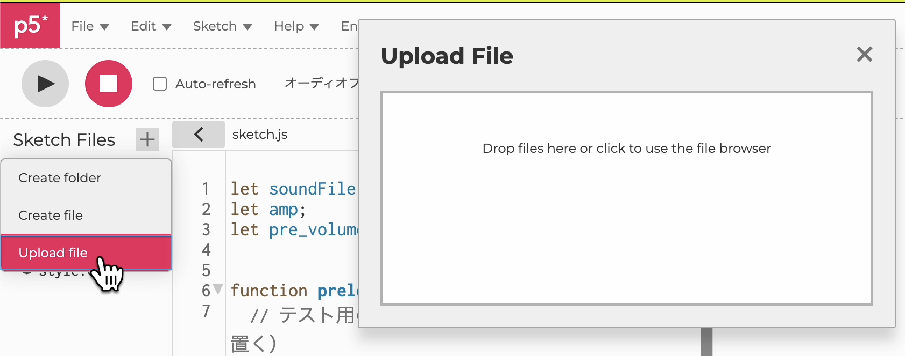
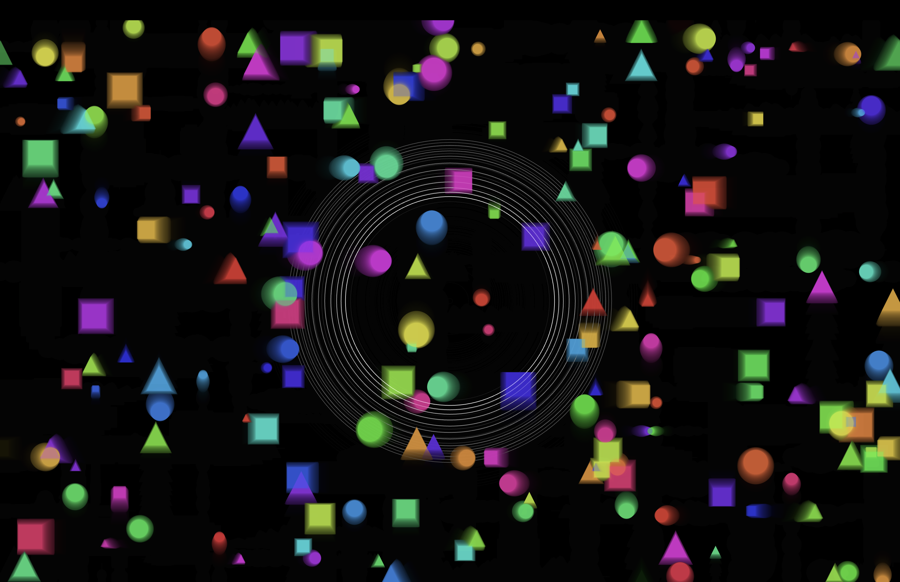

<!-- _unsafe: true -->
<style>
.center-img {
  display: block;
  margin: 0 auto;
}
</style>

# 第4回　クリエイティブ・コーディング入門
## 音の可視化①（振幅を使った可視化）

---

## オーディオリアクティブな表現

- リアルタイムで音に反応する視覚表現のこと
- 音の変化を視覚化することで、リアルタイムな変化を強調する
- 様々なビジュアル・プログラミング・ツールで
- 参考事例
  - [Sumberser - audio reactive Quartz Composer](https://www.youtube.com/watch?v=NVTiI9Zye_o)
  - [TouchDesigner AudioVisual](https://www.youtube.com/watch?v=w5RhMsfN6lU)

---

# 全体の流れ

- p5.soundライブラリを使った音の利用
- マイク入力からの音量を使った制御
- 音量のlerp関数を使ったスムージング
- 音源ファイルの利用
- 応用：パーティクル・クラスをオーディオ・リアクティブにアレンジ

---

# p5.soundライブラリについて

---

## p5.sound とは

- p5.js で音の処理を行うライブラリ
  - マイク入力・音量解析・周波数解析（FFT）など
  - サウンドファイルの再生・録音も可能
- 使われ方：音による図形の制御 = 可視化
  - 音量を図形・色・動きに変換
  - ピーク検知によるパーティクルや図形の生成

---

## p5.sound の読み込み

- Web Editor は`index.html`内でCDNによってライブラリが読み込まれている
  - CDN :外部サーバーからライブラリを読み込む仕組み
  - `<script src="https://cdn~~/p5.sound.min.js">`の部分

---

## 今回の内容：音量を使った描画

- 入力音のレベル値を使って描画を制御する
- 主に二つの利用方法がある
  ①：音量を使って大きさや色のパラメータを制御
    - ellipseやrectの大きさと色を変える
    - 動いているオブジェクトの大きさを制御する
  ②：閾値を設定して生成のトリガーにする
    - パーティクルやオブジェクトの生成に音量を利用する
- 今回は①の方を扱う
---


# マイクの入力音を使う

---

## マイク入力の音量を円の大きさに反映

- パソコンやスマホのマイク入力を取得する
  - `mic = new p5.AudioIn();`
- `mic.getLevel()` で、その瞬間の **音量の大きさ**（0.0〜1.0の範囲）を取得
- 音量を円の直径に変換するために **map() 関数**を使う
  - map()：ある値を別の範囲へ線形的に変換する関数
  - 使い方：`map(値, 入力最小, 入力最大, 出力最小, 出力最大)`
  - 例：`diameter = map(level, 0, 1, 0, 300);`
  - マイクの音が小さい場合→ 入力最大値を 0.1 などに調整する

---

# マイク入力の音量を円で可視化（[サンプルコード](https://editor.p5js.org/takano_ma/sketches/GH2QTmR3d)）

```javascript
let mic;
function setup() {
  createCanvas(800, 600);
  textAlign(CENTER, CENTER);
  // マイク入力を開始
  mic = new p5.AudioIn();
  mic.start(); // ブラウザがマイクへのアクセス許可を求める
}
function draw() {
  background(0);
  let level = mic.getLevel();
  // 音量を円の直径にマッピング
  let diameter = map(level, 0, 0.1, 0, width);
  noStroke();
  fill(0, 127, 255, 200);
  ellipse(width / 2, height / 2, diameter);
}
```

---


# 背景の透明度を下げて残像を残しておく（[サンプルコード](https://editor.p5js.org/takano_ma/sketches/jphz_RyWa)）

- 音量は変化が激しいため、そのままだと描画の変化も激しい
- 背景の透明度を低くすると前フレームの残像が残るので少し滑らかに見える

```javascript
function draw() {
  background(0, 5);//透明度を下げて残像が残るように
  let level = mic.getLevel();
  // 音量を円の直径にマッピング
  let diameter = map(level, 0, 0.1, 0, width);
  noStroke();
  fill(0, 127, 255, 200);
  ellipse(width / 2, height / 2, diameter);
}
```


---

# lerpを使った音量のスムージング
## （[サンプルコード](https://editor.p5js.org/takano_ma/sketches/rZLqwuBFj)）

---

## lerp()で音量の変化を滑らかに

- `getLevel()` の値をそのまま使うと変化が激しくなってしまう
- lerp関数を使って変化を滑らかにする
  - `lerp(a, b, t)`：a から b へ t の割合だけ近づける（0〜1）
- 前フレームの値用に `smoothLevel` を用意しておく
- `smoothLevel = lerp(smoothLevel, level, 0.1);`
- 得られた `smoothLevel` を `map()` で円の直径に変換


---

## lerp() を使ったコード

- 事前に `let smoothLevel = 0;` を宣言しておく
- draw() の中で：
  - `let level = mic.getLevel();`
  - `smoothLevel = lerp(smoothLevel, level, 0.1);`
  - `diameter = map(smoothLevel, 0, 1, 0, width);`
- あとは `ellipse(width/2, height/2, diameter);` で円を描画


---

## スムージングを用いたコード

```javascript
let mic;
let smoothLevel = 0;   // ← 追加

function setup() {
  mic = new p5.AudioIn();
  mic.start();
  //… 以下省略
}

function draw() {
  let level = mic.getLevel();

  smoothLevel = lerp(smoothLevel, level, 0.1);  // ← 追加
  let diameter = map(smoothLevel, 0, 1, 0, width);  // ← 変更
  //… 以下省略
}

```

---

# 音源ファイルの利用
## ([サンプルコード](https://editor.p5js.org/takano_ma/sketches/jPGdIBqct))

---

## 音源ファイルのアップロード方法（p5.js Web Editor）

- Web Editor では、**mp3 / wav などの音源ファイルをプロジェクトに追加**できる  
- 手順：
  1. エディタ左側の **「▶ Files」** を開く  
  2. **「Upload File」** をクリックしてファイル選択 or ファイルをドラッグで追加



---

## 音源ファイルの読み込み

- 事前に `preload()` 関数で音源ファイルを読み込む必要がある
- `preload()`内で`loadSound("ファイル名")` を使ってファイルを読み込み

```javascript
let soundFile;

function preload() {
  // 同じフォルダに .mp3 を置く
  soundFile = loadSound('input.mp3');
}
```

---

## p5.Amplitude を使った入力音の取得

- `p5.Amplitude`：音源の**全体の音量レベル**を取得するクラス
- `amp = new p5.Amplitude();` でインスタンス作成
- `amp.setInput(soundFile);` で対象の音源ファイルを指定

```javascript
let soundFile;
let amp;

function setup() {
  createCanvas(800, 800);

  amp = new p5.Amplitude();   // 音量解析用
  amp.setInput(soundFile);    // 読み込んだ音源を解析対象にする
}
```

---

## 再生に関する注意（クリックで再生・一時停止）

- ブラウザの仕様で「ユーザー操作なしで音を鳴らせない」ようになっている
- `getAudioContext().resume()` を **クリック時に呼ぶ**と安全
- 再生と一時停止は `soundFile.play()` / `soundFile.pause()` を切り替える

```javascript
function mousePressed() {
  // ブラウザのオーディオ制限対策
  if (getAudioContext().state !== 'running') {
    getAudioContext().resume();
  }
  // 再生／一時停止をトグル
  if (soundFile.isPlaying()) {
    soundFile.pause();
  } else {
    soundFile.play();
  }
}
```

---

## draw内での音量取得と可視化

- マイクの時とほとんど同じように`getLevel()`で0~1の音量レベルを取得
- lerpで変化を滑らかにして、mapで円の大きさの値に変換

```javascript
function draw() {
  background(0);
  // 現在の音量（0〜1くらい）
  let level = amp.getLevel();
  // スムージング（急に変化しないようになめらかに）
  let smoothed = lerp(pre_volume, level, 0.3);
  pre_volume = smoothed;
  // 音量に応じて円の大きさを変える
  let r = map(smoothed, 0, 0.3, 10, 1000, true);
  noFill();
  stroke(255);
  ellipse(width / 2, height / 2, r, r);
}
```


---


# 応用：音でパーティクルの大きさや速度を変える
## ([サンプルコード：マイク](https://editor.p5js.org/takano_ma/sketches/TkqIoAI6U))
## ([サンプルコード：音源ファイル](https://editor.p5js.org/takano_ma/sketches/gnxIzzbOA))

---

## 音でパーティクルを制御する考え方

- mic.getLevel() で「音量（0〜1）」を取得できる  
- 音量は揺れが激しいため **lerp() でスムージング**  
- スムージング後の値を **パーティクルのサイズ・速度の倍率に変換**  
- パーティクルの基本構造は前回扱ったため、今回は「音との連動」に注目

---

## 音量をスムージングして倍率に変換する

```javascript
let smoothed = 0;          // スムージング後の音量
let smoothing_ratio = 0.1; // 小さいほどゆっくり変化
let levelMax = 0.1;        // 想定する最大音量（環境に応じて調整）

function draw() {
  let level = mic.getLevel();           // その瞬間の音量
  smoothed = lerp(smoothed, level, smoothing_ratio);

  // 音量→大きさの倍率に変換
  let sizeScale = map(smoothed, 0, levelMax, 1, 10.0, true);

  // 音量→速度の倍率に変換
  let speedScale = map(smoothed, 0, levelMax, 0.1, 5.0, true);
}
```

---

## パーティクルに倍率を渡して反映させる

- update(scale) で **速度に倍率をかける**
- display(scale) で **大きさに倍率をかける**
- 音が大きいほど速く・大きく動く表現が可能

```javascript
for (let p of particles) {
  p.update(speedScale);   // ← 音量で速さを変える
  p.display(sizeScale);   // ← 音量で大きさを変える
}
```

---

## パーティクルクラス：サイズと速度に scale を反映

```javascript
class Particle {
  constructor(x, y) {
    this.x = x; this.y = y;
    this.col = random(0, 360);
    this.vx = random(-0.5, 0.5); this.vy = random(-0.5, 0.5);
    this.baseSize = random(5, 20); // 基本サイズ
  }
  update(scale) {
    this.x += this.vx * scale;  // 音量を速度にかける
    this.y += this.vy * scale;

    // 端で跳ね返る
    if (this.x < 0 || this.x > width) this.vx *= -1;
    if (this.y < 0 || this.y > height) this.vy *= -1;
  }
  display(scale) {
    noStroke();
    fill(this.col, 80, 100, 50);
    let s = this.baseSize * scale; // 音量でサイズを変える
    ellipse(this.x, this.y, s, s);
  }
}
```

---

## アレンジ：移動する方向を限定する

- パーティクルごとに縦か横のどちらかの移動に限定する
- 初期設定で移動軸を決める変数を用意
  - [マイクのコード](https://editor.p5js.org/takano_ma/sketches/fGRciqTxC)
  - [音源のコード](https://editor.p5js.org/takano_ma/sketches/B_rNYBOwh)

```javascript
  constructor(x, y) {
    //...
    this.v = random(-0.5, 0.5);
    this.direction = int(random(2)); //移動する軸を決める
    //...

  update(scale){
    if(this.direction == 0) this.x += this.v*scale; //x軸での移動
    if(this.direction == 1) this.y += this.v*scale; //y軸での移動
    //...
```

---

## アレンジ：パーティクルと円を組み合わせる([音源のコード](https://editor.p5js.org/takano_ma/sketches/PnQP4z4il))
- 大きく変化する一個の図形をメインの要素にする




---

## 本日のまとめ
- p5.sound による音入力と音量取得の基礎
- マイク入力と音源ファイルの利用方法
- 音量データを用いた図形サイズ制御の手法
- lerp() による音量変化のスムージング処理
- 音量を利用した円やパーティクルの反応表現

## 来週の内容(予定)
- FFTを使った周波数成分ごとの振幅値を利用した描画

