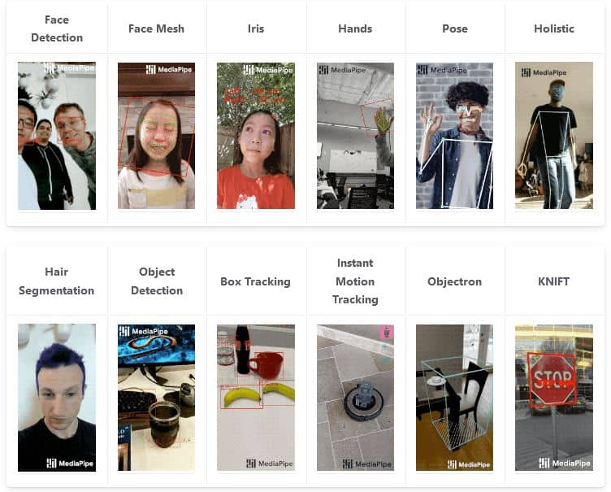
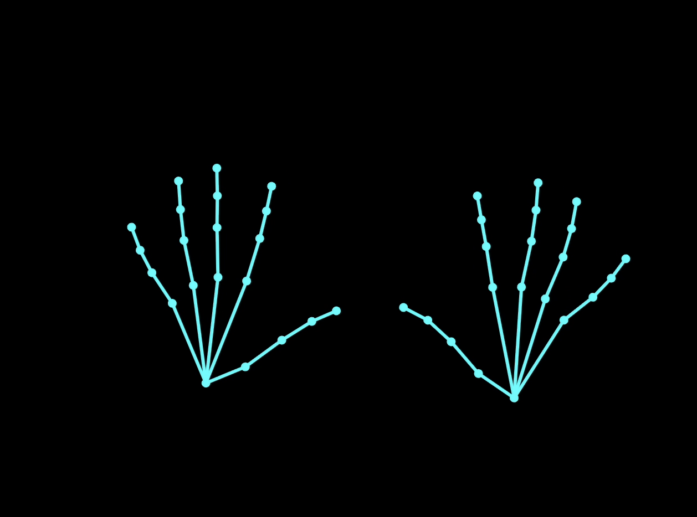
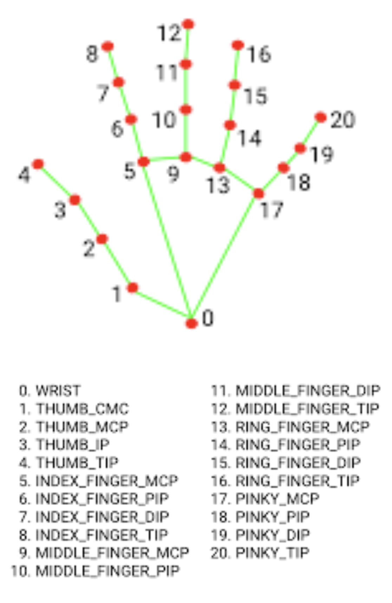
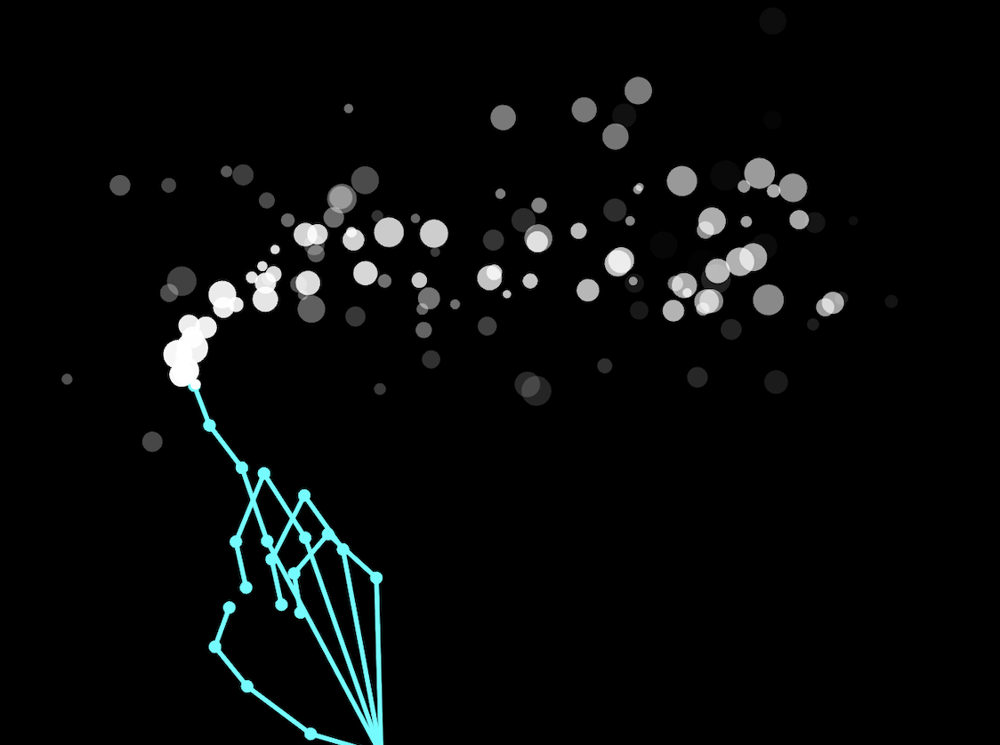
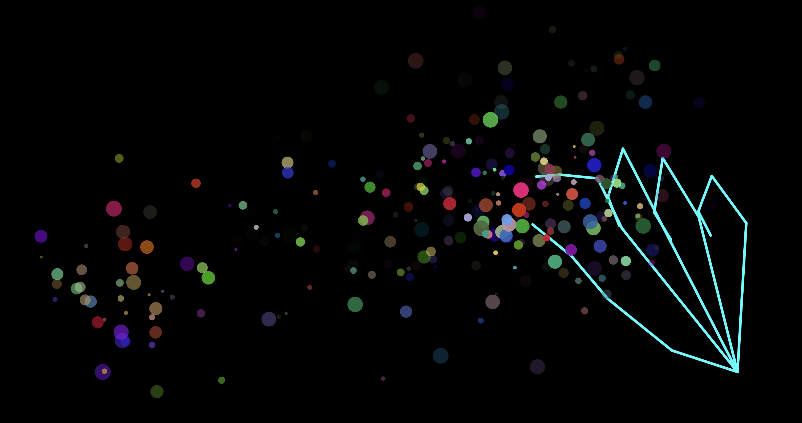
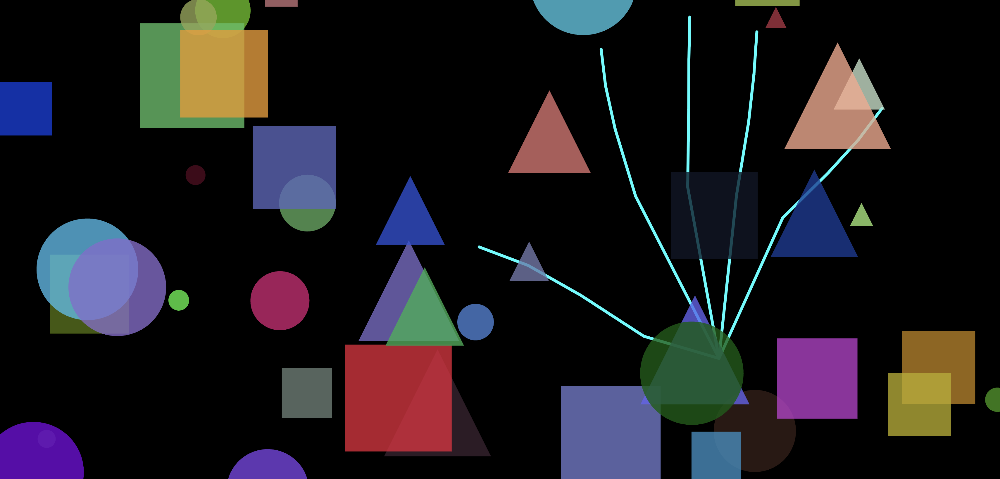

<!-- _unsafe: true -->
<style>
.twocol {
  display: flex;
  justify-content: center;
  align-items: center;
  gap:30px;              /* ← ここで間隔を調整 */
  width: 85%;
  margin: 0 auto;
}
.twocol .geometric_pattern_1 {
  width: 40%;     /* ← 左の画像のサイズ */
}
.twocol .geometric_pattern_2 {
  width: 50%;     /* ← 右の画像のサイズ */
}
.footer {
  font-size: 0.75em !important;
  color: yellow;
}
.footer a {
  color: black;
  text-decoration: none;
}

</style>


<!-- _unsafe: true -->
<style>
.center-img {
  display: block;
  margin: 0 auto;
}
</style>

# 第6回　クリエイティブ・コーディング入門
## 外部ライブラリの利用（画像認識による生体計測）


---

## 今日の内容

- 外部ライブラリの利用
- MediaPipeを使った手の位置情報を取得
- 応用例：手の位置情報を用いた表現
    - パーティクルの生成
    - 距離を使った描画の制御
- その他の生体情報の検出例

---

# 外部ライブラリの利用

---

## CDNで外部ライブラリを利用する


- htmlのscriptタグでCDNから読み込むことが可能
- p5.jsもCDNで読み込まれている

```html
<head>

<script src="https://cdn.jsdelivr.net/npm/・・・/p5.js"></script>
<script src="https://cdn.jsdelivr.net/npm/・・・/p5.sound.min.js"></script>

</head>
```


---

## MediaPipe

- Google提供の機械学習ライブラリ
- CDNで比較的簡単に利用できる
- 映像から生体情報を取得
- 音声認識などもできる

<div class="footer">
  <a href="https://ai.google.dev/edge/mediapipe/solutions/guide?hl=ja#available_solutions">参考：<u>MediaPipeソリューションズ</u></a>
</div>



---

## MediaPipeを使った生体計測

- 手や顔、姿勢などを点群として取得
- 座標情報（landmarks）が主な出力
- 計測や可視化表現に向いている
- 今回はこれを利用する


---

# 手の位置情報を取得
## [サンプルコード](https://editor.p5js.org/takano_ma/sketches/m9cIM9XnN)




---

## MediaPipeを使う手順

- `createCapture()`でカメラ映像を`cam`として取得する
- `Hands`クラスを使って手の検出モデルを初期化する
- `onResults()`で認識結果を`handsRes`に保存する
- `processFrame()`内で`hands.send()`を繰り返し実行する
- `draw()`関数で手の位置情報を使った描画を行う

---

## index.htmlでライブラリを読み込む

- MediaPipe SolutionsはHTMLの`script`タグで読み込む
- Hands用ライブラリを追加すると`Hands`クラスが使える
- CDNを使うことでローカル環境構築が不要になる
- p5.js → MediaPipe → `sketch.js`の順で読み込む
- 読み込み順を間違えるとクラスが未定義になる

```javascript
<script src="https://cdn.jsdelivr.net/npm/p5@1.11.11/lib/p5.js"></script>
<script src="https://cdn.jsdelivr.net/npm/@mediapipe/hands@0.4.1675469240/hands.js"></script>
<script src="sketch.js"></script>
```

---

## グローバル変数を用意

- インスタンス用の変数や配列を用意
- `processing`は非同期処理の重複実行を防ぐために用意


```javascript
let cam; //カメラ用のインスタンス変数
let hands; //MediaPipe Hands用のインスタンス変数
let handsRes = null; // 毎フレーム更新される認識結果を保存する
let processing = false;
```

---

## 手の関節の番号

- `MULTI_HAND_LANDMARKS`に配列番号で手の関節の位置情報が格納される
- 関節を`line`で繋げるための配列を用意

```javascript
//手の形状をlineでつなげる配列を用意
const HAND_CONNECTIONS = [
  [0,1],[1,2],[2,3],[3,4],
  [0,5],[5,6],[6,7],[7,8],
  [0,9],[9,10],[10,11],[11,12],
  [0,13],[13,14],[14,15],[15,16],
  [0,17],[17,18],[18,19],[19,20],
];
```



---

## setup関数でのカメラの準備

- `setup()`内で`createCapture()`を呼びカメラを起動する
  - `{ flipped: true }`で鏡のような左右反転映像にする
- `cam.size()`でカメラ映像と`canvas`サイズを揃える
- `cam.hide()`でHTMLのvideo表示を非表示にする

```javascript
cam = createCapture(VIDEO, { flipped: true });
cam.size(640, 480);
cam.hide();
```

---

## setup関数でのHandsのセットアップ

- インスタンスにモデルファイルを読み込む
- `setOptions()`で最大手数や検出精度を設定する

```javascript
hands = new Hands({ locateFile: (file) => base + file });
hands.setOptions({
  maxNumHands: 2, //検出可能な最大手数
  modelComplexity: 1, //モデル精度（0:軽量〜2:高精度）
  minDetectionConfidence: 0.5, // 手を検出する最低信頼度
  minTrackingConfidence: 0.5, // 検出後の手を追跡する最低信頼度
  selfieMode: true, //セルフィーモードを設定（左右反転）
});
```

---

## setup関数でイベント処理を登録する

- 推論完了時に結果を受け取る処理を登録する
- カメラ準備完了後に推論ループを開始する処理を登録する

```javascript
hands.onResults(function (res) {        // 推論完了時に呼ばれる処理を登録
  handsRes = res;                       // 最新の推論結果を保存
});

cam.elt.onloadedmetadata = function () { // カメラ準備完了後の処理を登録
  requestAnimationFrame(processFrame);   // 推論ループを開始
};
```

---

## asyncを使って非同期処理にする

- `hands.send()` の推論に時間がかかるため、`await`で完了まで待機させる
- 描画ループ（p5.js）と推論処理を安全に同期させるための処理
- 重い処理でも画面更新が止まらないようにする
```javascript
async function processFrame() {
  if (!cam?.elt || processing) {          // カメラ未準備 or 推論中なら
    requestAnimationFrame(processFrame);  // 次フレームだけ予約して
    return;                               // 今回の処理は行わない
  }
  processing = true;                      // 推論中フラグを立てる
  await hands.send({ image: cam.elt });   // 推論完了まで待機（非同期）
  processing = false;                     // 推論終了 → フラグ解除
  requestAnimationFrame(processFrame);    // 次のフレームを処理
}
```


---

## draw関数で背景とカメラの映像を用意

- `background()` で毎フレーム背景をクリアする
- `image(cam, ...)` でカメラ映像をキャンバス全体に描画する
  - `image(img, x, y, width, height);`
  - 表示位置（x, y）とサイズ（width, height）を指定できる


```javascript
background(0);
//カメラの映像を表示（コメントアウトでオフに）
image(cam, 0, 0, width, height);
```

---

## draw関数で推論結果の有無をチェック

- 推論結果がまだ届いていない場合は以降の描画を行わない
- ランドマーク情報がない場合も処理をスキップする
```javascript
  // 推論結果が未取得、または手が検出されていない場合は処理をスキップ
  if (
    handsRes === null ||
    handsRes.multiHandLandmarks === null
  ) {
    return;
  }
```

---

## draw関数で手のランドマークを描画

- `handsRes.multiHandLandmarks` に手のランドマーク（関節点）が配列で格納されている（例：`lm[0].x` = 手首の x 座標）
- 値は0〜1に正規化されているため，`width` と`height`を掛けてcanvas座標に変換

```javascript
for (let i = 0; i < handsRes.multiHandLandmarks.length; i++) {
  let lm = handsRes.multiHandLandmarks[i];
  stroke(0, 255, 255);
  strokeWeight(3);
  for (const [a, b] of HAND_CONNECTIONS) {
    line(lm[a].x * width, lm[a].y * height, lm[b].x * width, lm[b].y * height);
  }
  noStroke();
  fill(0, 255, 255);
  for (const p of lm) {
    circle(p.x * width, p.y * height, 8);
  }
}
```

---

# 応用①：手の位置情報を使ってパーティクルを描画
## [サンプルコード](http://editor.p5js.org/takano_ma/sketches/CZCZu-Nr2)




---

## 指の位置からパーティクルを生成する

- Particleクラスをコピーして、手の位置情報を使ってパーティクルを生成

```javascript
  for (let i = 0; i < handsRes.multiHandLandmarks.length; i++) {
    let lm = handsRes.multiHandLandmarks[i];
    /* 中略 */
    //人差し指(lm[8])の位置を使ってパーティクルを生成
    particles.push(new Particle(lm[8].x*width, lm[8].y*height));  
  }
```

---

# フルスクリーンモードに設定（[サンプルコード](https://editor.p5js.org/takano_ma/sketches/qlIJwftWR)）

- `canvas(windowWidth, windowHeight)`でキャンバスをウィンドウサイズに
- 描画位置は`lm[a].x * width`などで自動的にキャンバスサイズに調整される

```javascript
function windowResized(){
  resizeCanvas(windowWidth, windowHeight);
}
// fキーでフルスクリーンの切り替えをできるようにする
function keyPressed(){
  if(key == "f"){
    let fs = fullscreen();
    fullscreen(!fs);
  }
}
```

---

# 応用②：dist関数による距離測定による描画
## [サンプルコード](https://editor.p5js.org/takano_ma/sketches/dZgm8eUoH)


---

## 人差し指と親指の距離を測って円のサイズを

- 二点間の距離を`dist関数`で取得して、`map関数`で円のサイズに反映

```javascript
    const a = lm[4];
    const b = lm[8];
    const ax = a.x * width;
    const ay = a.y * height;
    const bx = b.x * width;
    const by = b.y * height;
    const d = dist(ax, ay, bx, by);
    let targetSize = map(d, 20, 180, 10, 500);
    targetSize = constrain(targetSize, 10, 500);
    smoothSize[i] = lerp(smoothSize[i], targetSize, 0.25);
    const cx = (ax + bx) * 0.5;
    const cy = (ay + by) * 0.5;
    ellipse(cx, cy, smoothSize[i]);
```

---

## 指を摘んでいるときだけパーティクルを生成する（[コード](https://editor.p5js.org/takano_ma/sketches/zkCSAfeQJ))

- `dist`で指の間隔が狭い状態の時だけパーティクルを生成するようにする

```javascript
if(d < 150){particles.push(new Particle(cx, cy, d));}
```



---

## 指の開き具合でパーティクルのサイズを調整する（[コード](https://editor.p5js.org/takano_ma/sketches/Nv01ZMjlB))

- `dist`を`map`でオブジェクトの倍率として利用

```javascript
targetScale = map(d, 20, 180, 0.2, 10.0);
```




---


# 予備資料：その他の生体情報の検出

---

## 姿勢と顔の検出

- `hand`以外にも`pose`と`face`のモデルが利用できる
- 基本的には`hand`のものと同じ
- 姿勢情報の検出 ([サンプルコード](https://editor.p5js.org/takano_ma/sketches/rD96sGTJ3))
- 顔の検出([サンプルコード](https://editor.p5js.org/takano_ma/sketches/FS6Svkff2))
