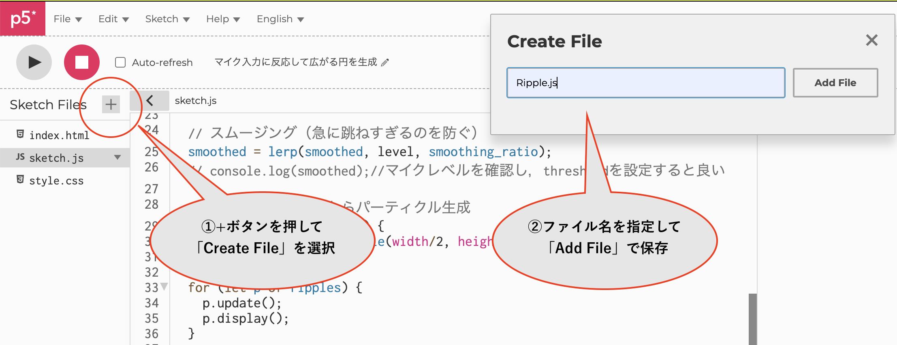
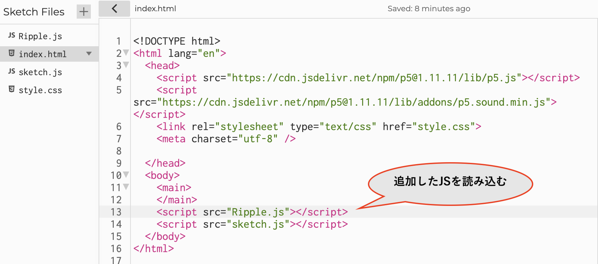
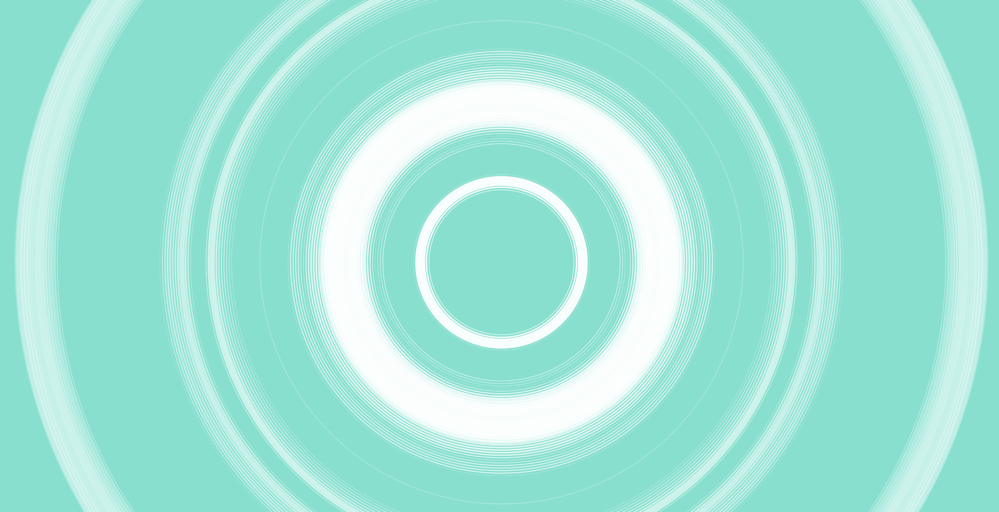
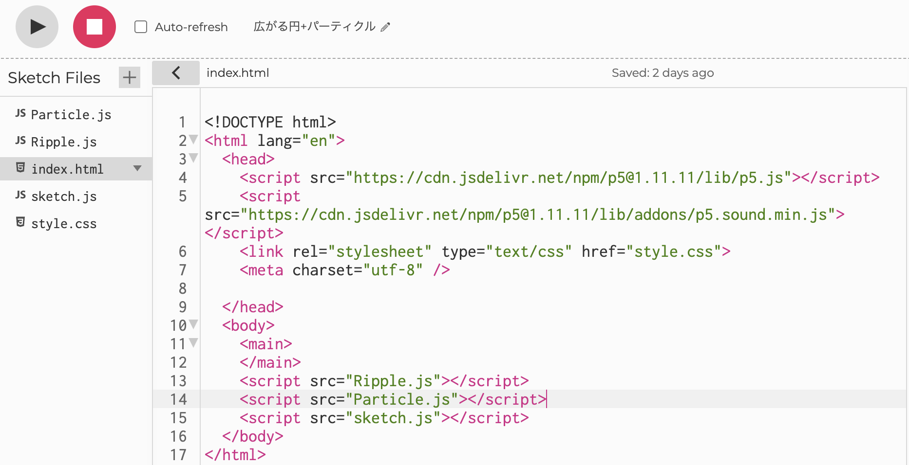
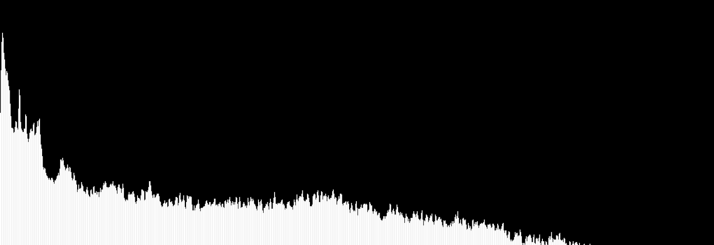

<!-- _unsafe: true -->
<style>
.center-img {
  display: block;
  margin: 0 auto;
}
</style>

# 第5回　クリエイティブ・コーディング入門
## 音の可視化②（閾値を設定した描画、FFTを使った可視化）


---

## 今日の内容

- 入力音に対する閾値を設定してオブジェクトを生成
  - クラスをJSファイルに分けて管理
  - 広がる円の生成
  - パーティクルの生成
- FFTを使った周波数成分の描画
  - スペクトル・アナライザーの描画
  - アナライザーのアレンジ（色は配置など）
- 応用：複数の要素を組み合わせたオーディオ・ビジュアライザーの作成

---

# 閾値を設定して、広がる円を生成
## ([サンプルコード](https://editor.p5js.org/takano_ma/sketches/2NW_8FF8K))

---

## 波紋を表すクラス（Ripple）の作成

- パーティクルのコードをアレンジして、広がって消えていく円のクラスを作る
- 基本的な部分はパーティクルと同じ
- `update()` で波紋を少しずつ大きくして、`lifespan`で少しずつ消す
- `display()` で塗りつぶしなしで枠線だけの円を描画


---

## クラスを別ファイルに分けて管理する

- sketch.js が長くなってきたら、クラスは専用の JS ファイルに分けて整理すると便利



---

## index.htmlで読み込む

- 作成したクラスファイルは index.html で読み込み、sketch.js から利用できる



---

## Rippleクラスの中身

- 基本はほとんどパーティクルのコードと同じ
- `constructor`の初期設定で円が広がる速度を設定
    - `this.spread_speed = 7;` ← 毎フレーム7px大きくなる設定
- `update()`で円の大きさを毎フレーム更新
    - `this.e_size+=this.spread_speed;` ← 7pxずつ大きくなる
    - `this.lifespan -= 1;` ← 透明度が1ずつ下がり、徐々に薄くなっていく
---

```javascript
class Ripple {
  constructor(x, y) {
    this.x = x;
    this.y = y;
    this.e_size = 100;　//初期の円のサイズ
    this.spread_speed = 7; //広がる速さ
    this.lifespan = 255;
  }
  update() {
    this.e_size+=this.spread_speed; // 各フレームで円を大きくする
    this.lifespan -= 1;
  }
  display() {
    noFill();
    strokeWeight(2);
    stroke(255, this.lifespan);
    ellipse(this.x, this.y, this.e_size);
  }
  isDead() {
    return this.lifespan <= 0;
  }
}
```

---

## 閾値を設定 → 音量が閾値を超えたら波紋を生成

- `threshold`変数を用意して、音量の閾値を設定
    - `getLevel()`が0~1の出力値は範囲の値
    - 環境に合わせて`threshold`の値を調整する
- draw関数内で閾値を超えたらRippleクラスのインスタンスを生成する
    - `if (smoothed > threshold) {/*インスタンス作成*/}`
    - パーティクルの時と同じように，配列に追加する

---

```javascript
let ripples = []; //波紋のインスタンスを保持する配列を準備
let threshold = 0.04;  // 閾値の設定、この音量を超えたら生成

//setup()は前回と同じマイクの設定

function draw() {
  background("#68E2CE");
  let level = mic.getLevel();// マイク音量を取得とスムージング
  smoothed = lerp(smoothed, level, smoothing_ratio);
  
  // スムージングした値が閾値を超えたらインスタンスを作成
  if (smoothed > threshold) {
    ripples.push(new Ripple(width / 2, height / 2));
  }
  //あとは全てのインスタンスのupdate()とdisplay()、idDead()の処理
  //...
}
```

---

## 予備のコード：矢印キーで閾値を調整する

- 入力値に合わせられるように矢印キーで閾値を調整できるようにしておく

```javascript
function keyPressed(){
  if (key == "ArrowUp") {// 上キーで閾値を上げる
    threshold += 0.001;
    if (threshold > 0.5) {
      threshold = 0.5; //最大値を設定しておく
    }
    console.log(threshold);
  }else if (key == "ArrowDown") {// 下キーで閾値を下げる
    threshold -= 0.001;
    if (threshold < 0.01) {
      threshold = 0.01; //最低値を設定しておく
    }
    console.log(threshold);
  }
}
```

---

## アレンジ：音量に応じて線の太さを変える([コード](https://editor.p5js.org/takano_ma/sketches/ezlJKNoaD))

- 音量で線の太さが変わるようにして，音の強弱を表現
```javascript
//draw関数
    let weight = map(smoothed, threshold, 0.1, 0.1, 10, true);
    if (smoothed > threshold) {
        ripples.push(new Ripple(width/2, height/2, weight));
    }
//rippleクラス
    constructor(x, y, s_weight) { // 線の太さの引数を追加
        //...
        this.s_weight = s_weight;
        //...
    }
    display() {
        //...
        strokeWeight(this.s_weight);// strokeWeightに反映
        //...
    }
```

---

## 線を太くした描画のイメージ




---

# 閾値を利用したパーティクルの描画を追加する
## ([コード](https://editor.p5js.org/takano_ma/sketches/UR3w5LgFO))

---
## 閾値を超えたらパーティクルも同時に生成する


---

## Particle.jsを作る
- パーティクルのクラスを別の JS ファイルとして用意し、index.html で読み込む




---

## Particle.jsの中身（前回のものと同様）

```javascript
class Particle {
  constructor(x, y) {
    this.x = x;
    this.y = y;
    this.vx = random(-0.5, 0.5);
    this.vy = random(-0.5, 0.5);
    this.e_size = random(5, 30);
    this.lifespan = 255;
  }
  update() {
    this.x += this.vx;
    this.y += this.vy;
    this.lifespan -= 1;
  }
  display() {
    noStroke();
    fill(255, this.lifespan);
    ellipse(this.x, this.y, this.e_size);
  }
  isDead() {
    return this.lifespan <= 0;
  }
}
```

---

## sketch.jsでparticleクラスを利用

```javascript
let particles = []; // インスタンス用の配列

//draw関数内
    // 閾値を超えた際の処理にparticleの生成を追加
    if (smoothed > threshold) {
      ripples.push(new Ripple(width/2, height/2, weight));
      particles.push(new Particle(random(width), random(height)));
    }
    //...あとはupdate(), display(), isDead()の流れを記述

```

---

# FFTによるスペクトル・アナライザー
## ([コード](https://editor.p5js.org/takano_ma/sketches/N53WCSIn_))

---


## p5.FFT

- FFT（Fast Fourier Transform）
  - 周波数ごと成分に分離する方法
- p5.FFT クラス
  - `fft = new p5.FFT([smoothing],[bins]);`でfftのインスタンスを作成
    - smoothingは0~1の範囲で調整．大きいほどスムーズ，デフォルトは0.8
    - bins：FFT の帯域数（64/128/256/512/1024 など 2 のべき乗を使用）
        - デフォルトは1024
  - `fft.setInput([input]);` でマイクや音源を入力する

---

## FFTでスペクトルを可視化

- FFTで **周波数ごとのエネルギー（0〜255）** を配列として取得
- 配列のインデックスが **左＝低音 → 右＝高音**
- 各要素を **棒グラフの位置と高さ** に対応させて描画




---

## スペクトラムアナライザーとは

- 音を **周波数ごとの成分** に分解して強さを棒グラフで表示するもの
- 左から右に向かって **低音 → 中音 → 高音** の順に並ぶ
- 棒の高さ = その帯域のエネルギーの大きさ（p5.jsでは 0〜255）
- p5.FFTで `fft.analyze()` を使うと，この「周波数ごとの強さの配列」が取得できる
- その配列の値を，**x座標（位置）と高さ（h）にマッピングして描画**すると，
  自作のスペクトラムアナライザーになる

---

## p5.FFT とマイクの準備（setup内）

```javascript
let mic;
let fft;

function setup(){
  createCanvas(windowWidth, 500);
  
  mic = new p5.AudioIn();
  mic.amp(1); // マイク入力の音量を調整
  mic.start();
  
  fft = new p5.FFT(0.9); // FFTのインスタンス作成，0.0〜1.0でスペクトルのスムージング
  fft.setInput(mic);
}
```

---

## FFTでスペクトルを取得する

```javascript
function draw() {
  background(0);
  
  let spectrogram = fft.analyze();
  
  noStroke();
  fill(255);
  for(let i = 0; i < spectrogram.length; i++){
    let x = map(i, 0, spectrogram.length, 0, width);
    let h = map(spectrogram[i], 0, 255, 0, height);
    rect(x, height, 1, -h);
  }
  
}
```

---


# アナライザーの色とサイズを調整
## ([コード](https://editor.p5js.org/takano_ma/sketches/8-n0Vdalr))

---

## ビンの色とサイズを調整する


- ビンの横幅（解像度）を変数として設定し、その値に合わせて描画
- HSBモードで帯域ごとに固有の色相の値を設定する


---

### setup関数

```javascript
let mic;
let fft;
let resolution = 10; //ビンの幅 ≒ 解像度

function setup() {
  createCanvas(windowWidth, 500);
  
  mic = new p5.AudioIn();
  mic.start();
  
  fft = new p5.FFT(0.9, 1024);
  fft.setInput(mic);
  
  background(0);
  colorMode(HSB, 360, 100, 100, 100); // HSBに設定
}
```

---

### draw関数

- for文のカウンター変数を、`i+=resolution`にしてビンのサイズに合わせた描画に
```javascript
function draw() {
  background(0);
  
  let spectrogram = fft.analyze();
  
  noStroke();
  // resolutionのサイズごとにFFTのビンを描画する
  for(let i = 0; i < spectrogram.length; i+=resolution){
    let x = map(i, 0, spectrogram.length, 0, width);
    let h = map(spectrogram[i], 0, 255, 0, height);
    let bin_hue = map(i, 0, spectrogram.length, 0, 360); // mapでHueの値に
    fill(bin_hue, 100, 100, 100);
    rect(x, height, resolution, -h);
  } 
}
```

---

# アレンジ①：アナライザーのデザインを変える
## ([コード](https://editor.p5js.org/takano_ma/sketches/fhPJmAHBH))

---

## シンメトリックなアナライザー + 音に反応する円の組み合わせ


---

## シンメトリックなアナライザーを作成
- `rectMode(CENTER)`に設定して，上下に四角形が伸びるようにする
- `map(i, 0, spectrogram.length, 0, width/2);`にして画面の半分の幅に
- rectを二つ用意して，`width/2`を基準に左右に描画する

```javascript
  let spectrogram = fft.analyze();
  
  noStroke();
  for(let i = 0; i < spectrogram.length; i+=resolution){
    let x = map(i, 0, spectrogram.length, 0, width/2);
    let h = map(spectrogram[i], 0, 255, 0, height/2);
    let bin_hue = map(i, 0, spectrogram.length, 200, 360);
    fill(bin_hue, 100, 100, 100);
    rect(width/2 + x, height/2, resolution/2, h);
    rect(width/2 - x, height/2, resolution/2, h);
  }
```

---

## +α オーディオリアクティブな要素を組み合わせる
- 他の描画要素を組み合わせてみる

```javascript
  let level = mic.getLevel();
  smoothed = lerp(smoothed, level, 0.1);
  
  let e_size = map(smoothed, 0, 0.5, 10, 1000,);
  
  noFill();
  stroke(255);
  ellipse(width/2, height/2, e_size);
```

---

# アレンジ②：複数の描画要素を組み合わせる
## ([コード](https://editor.p5js.org/takano_ma/sketches/cEG6NqF-S))


---

## パーティクル+アナライザーなど

- 最初に設定したクラスなどを組み合わせたリアクティブな表現を作る
- 色も調整することで統一感を出したデザインにしてみる
