<!-- _unsafe: true -->
<style>
.twocol {
  display: flex;
  justify-content: center;
  align-items: center;
  gap:30px;              /* ← ここで間隔を調整 */
  width: 85%;
  margin: 0 auto;
}
.twocol .geometric_pattern_1 {
  width: 40%;     /* ← 左の画像のサイズ */
}
.twocol .geometric_pattern_2 {
  width: 50%;     /* ← 右の画像のサイズ */
}
.footer {
  font-size: 0.75em !important;
  color: yellow;
}
.footer a {
  color: black;
  text-decoration: none;
}

</style>


<!-- _unsafe: true -->
<style>
.center-img {
  display: block;
  margin: 0 auto;
}
</style>

# 第7回　クリエイティブ・コーディング入門
## 最終作品の制作


---

## 今日の内容

- 授業コードの一覧
- p5.js のコードをダウンロード
- VS Codeでp5.jsを実行(Live Server)
- ブラウザの描画領域を調整
- まとめ（最終的な成果物に関して）


---

# 授業コードの一覧

---

## 授業のコードをまとめたサイト（[リンク](https://takanoma1990.github.io/p5js-slides/sample_code/index.html)）
- これまで扱ったコードをまとめたサイトを公開中
- 最終的な成果物の参考として利用してください


---


## 最終的な制作のイメージ


- 目標：各自2つか3つ程度のp5.jsによる描画プログラムを作る
  - （できれば）成果物として学内のどこかでプロジェクション展示
  - プロジェクションが難しい場合は「作品集」としてサイトを作成
- 期限：1月中に出来たプログラム or リンクをSlackにて共有
  - もし余裕がなければ2月中に送ってもらっても大丈夫です
- 提出方法：zip形式 or sketch.jsのコードを共有


---

## 展示のイメージ

- 案：常設モニターをイニシアチブ棟に設置
- ミニPC(購入予定)を常時稼働させてスクリーンセーバー的に配置
- Webカメラ・マイクの設置もできるので、映像と音の入力も可能
  - ⚠️：マイクの入力は可能だが、音楽の自動再生は難しい

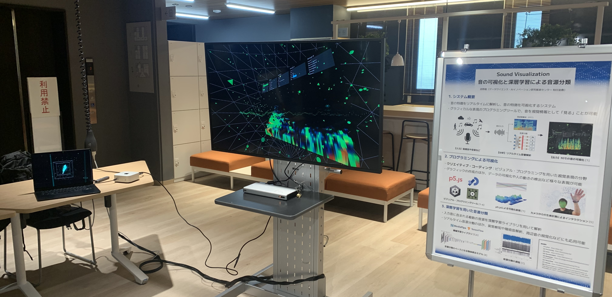

---

## p5.jsの制作イメージ

1. グラフィック：読み込まれるたびにランダムに描画が変わる静止画像
2. アニメーション：自律的に動く図形を使った表現
3. インタラクション：カメラや音の入力を使った視覚表現・可視化表現


---

# p5.js のコードをダウンロード

---

## Web Editorで作ったコードをダウンロード
- Web Editorから任意のコードを選ぶ
  - 自分のアカウントでも人のアカウントでも良い
  - ([サンプルコード](https://editor.p5js.org/takano_ma/sketches/CZCZu-Nr2))
- 上部のメニューから File → Downloadを選択
- html, css, jsがまとまったzipが保存される
  - → Editor上で完成している場合は、そのままzipを提出してもOK


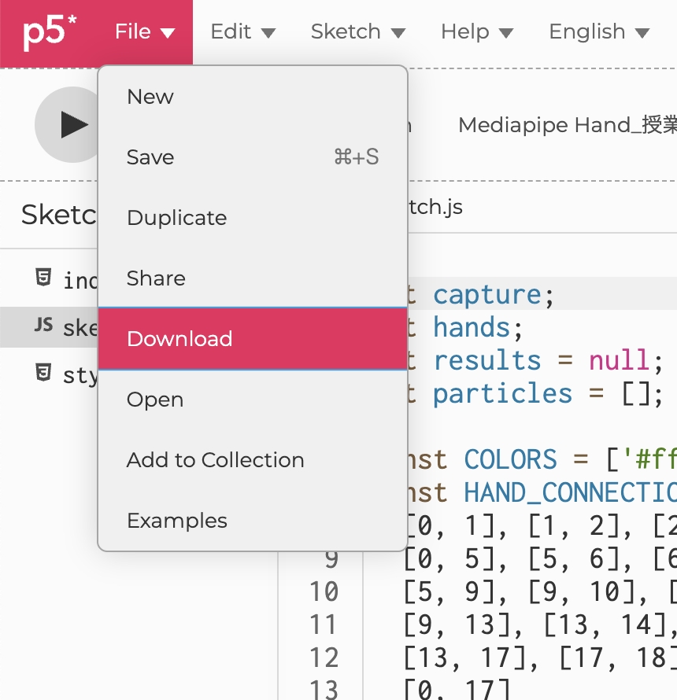

---

## ダウンロードファイルの中身
- htmlなど以外のCDNのライブラリも保存される
- html内のコードはCDNのままなので、オフライン実行の際に利用できる
- このフォルダでVS Codeでコーディングと実行ができるようになる
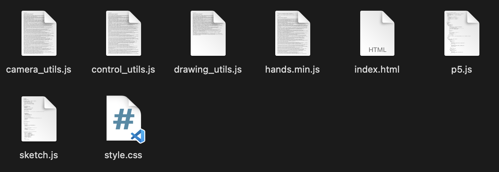

---

## (もしくは空のテンプレートを使う）
- GitHubにからのテンプレートが上がっている
- 初期設定の状態で始めたい場合はこれを利用する
- https://github.com/osteele/p5-template

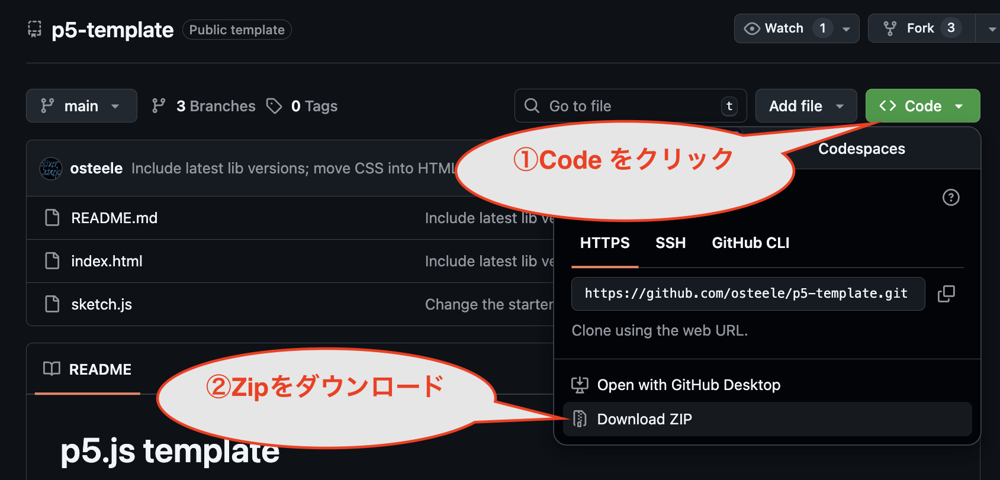

---

# VS Codeでp5.jsを実行(Live Server)

---


## VS Codeで新規ウィンドウを開く
- VS Codeを立ち上げる、もしくはメニューから「新しいウィンドウ」
- 左側のメニューの一番上のファイル・アイコンを選択
- 「フォルダーを開く」でp5jsのフォルダを指定、もしくはフォルダをドラッグ&ドロップ


--- 
## フォルダを信頼するかの確認画面
- 確認画面が出るので、「はい、作成者を信頼します」を選択

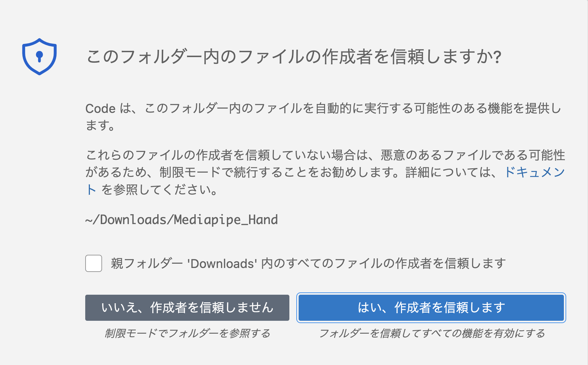

---

## フォルダの表示

- 確認画面で信頼するを選択後、左側にファイル一覧が表示される
- 任意のファイルを選ぶとコードを確認・修正ができる

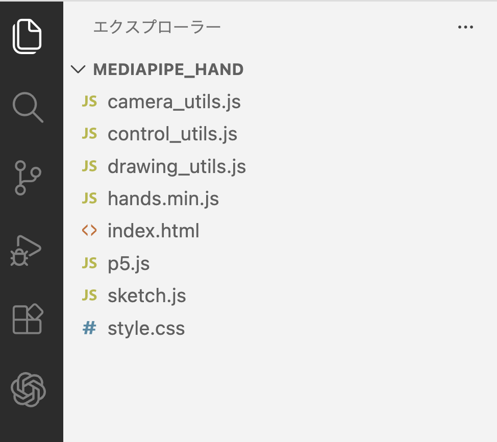


---

## Live Serverをインストール

- ローカルで簡単にWebサイトをプレビューできる拡張機能
- 左側の拡張機能のアイコンを選択し「Live Server」を検索してインストール
  - 既に入れている場合は、次のページで実行してみる

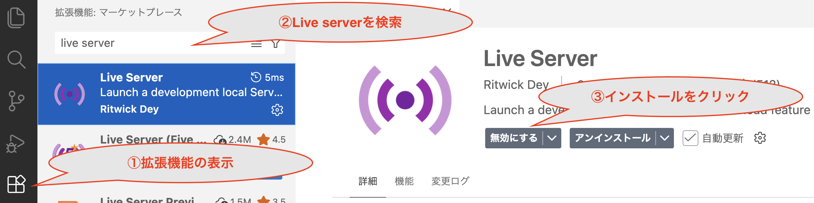

---

## Live Serverで実行してみる

- Live Serverのインストールが終わったら、サーバーを起動してみる
- ファイル内のindex.htmlを右クリック
- 「Open with Live sever」を選択
  - ブラウザ上でp5.jsのプログラムが動くようになる

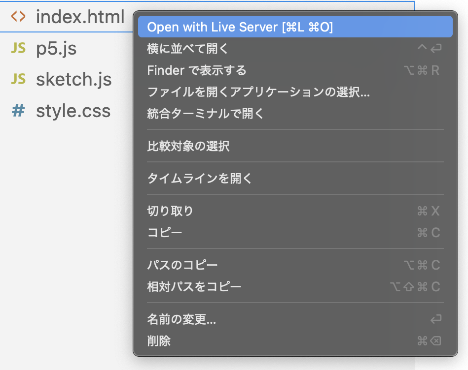


---

## ブラウザでの描画

- Live Serverを実行すると、自動的にブラウザが起動する
- エディタなしでキャンバスの部分のみ描画される
- サーバ起動状態でコードを更新すると、ブラウザ側も自動更新される

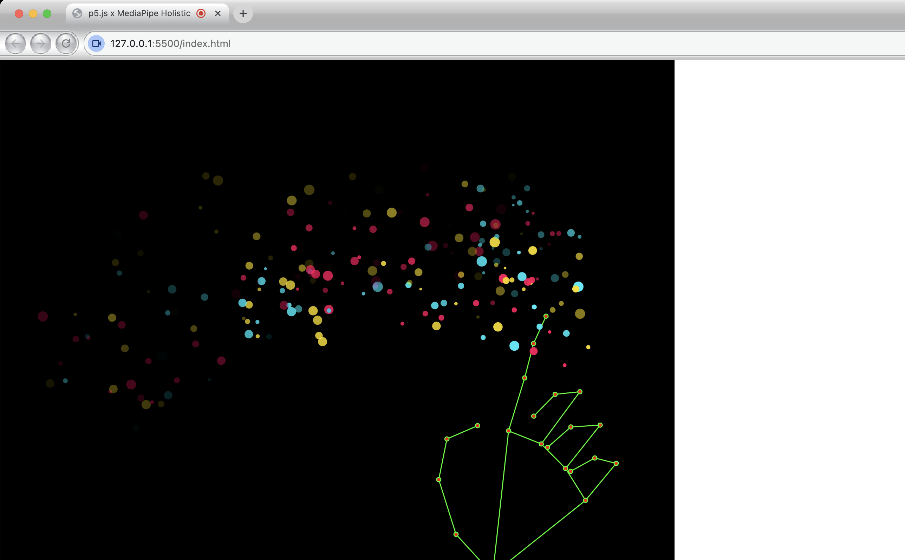

---

# ブラウザの描画領域を調整


---

## デフォルトのキャンバス位置

- エディタのコードをそのまま使うと、ブラウザの左側に描画される
- 描画範囲の調整、CSSの変更などで描画位置を調整する
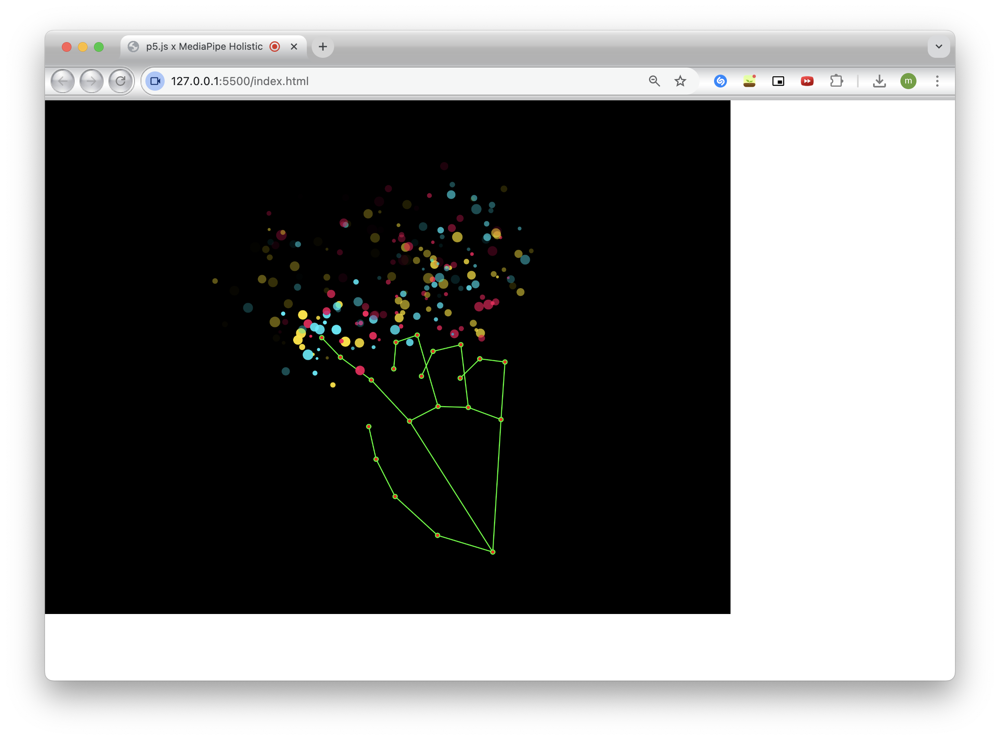

---

## Canvasをウィンドサイズにしておく
- `setup`関数で最初からウィンドウサイズにしておく
- `windowResized`関数でウィンドサイズが変わっても自動調整されるようにする
- これらを入れることで、フルスクリーン描画もしやすくなる

```javascript
function setup(){
  createCanvas(windowWidth, windowHeight);
}

function windowResized(){
  resizeCanvas(windowWidth, windowHeight);
}
```

---

## ウィンドサイズに合わせた際の描画

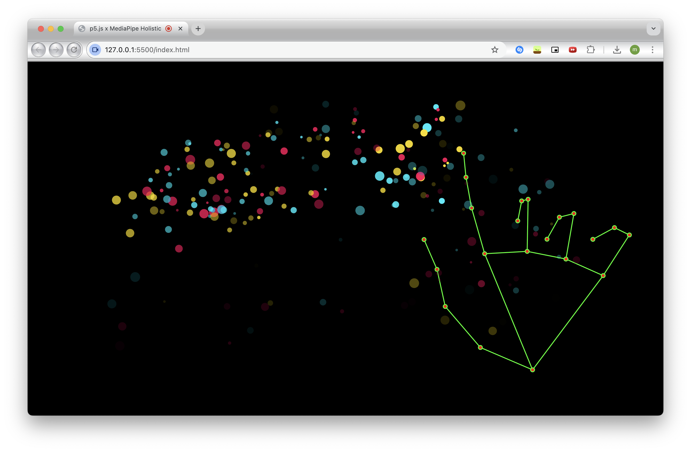

---

## CSSを調整してキャンバスを中央に配置
- `style.css`を下記のコードに書き換えると、canvasをブラウザ中央に配置できる
```css
html, body {
  margin: 0;
  padding: 0;
  width: 100%;
  height: 100%;
}
body {
  display: flex;
  justify-content: center; /* 横中央に指定*/
  align-items: center;     /* 縦中央に指定*/
}
canvas {
  display: block;
}
```

---

## CSSでCanvasを中央にした際の描画
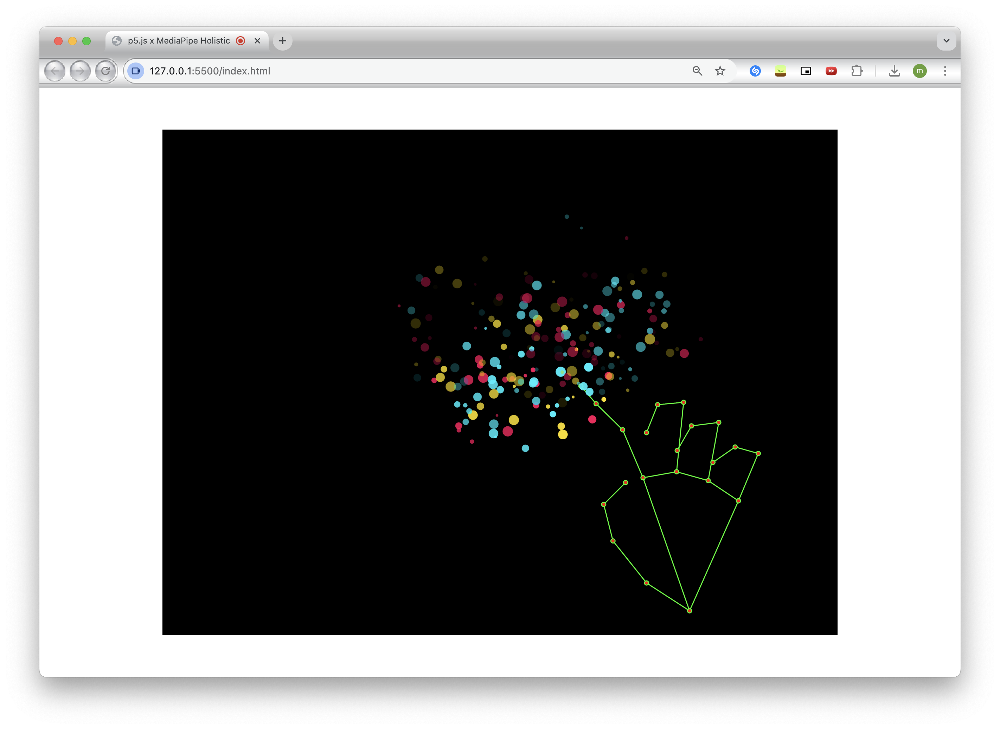

---

# まとめ（最終的な成果物に向けて）


- 最終制作（できれば）
  - p5.js の作品を **2〜3 点** 制作
  - プロジェクション展示を想定（もしくはweb掲載）
  - 静止画、アニメーション、インタラクション、音の可視化など

- 提出について  
  - **1月中** に プログラム（Zip形式） または 作品ページのリンクを Slack に共有  
  - 難しければ2月中の提出でも問題ないです

---

# 参考資料

---

## 参考サイト：p5.js Exampleページ

- https://p5js.org/examples/ にてp5.jsを使ったサンプルコードが見れる
- 基本的な描画から応用的なものまで記載されている


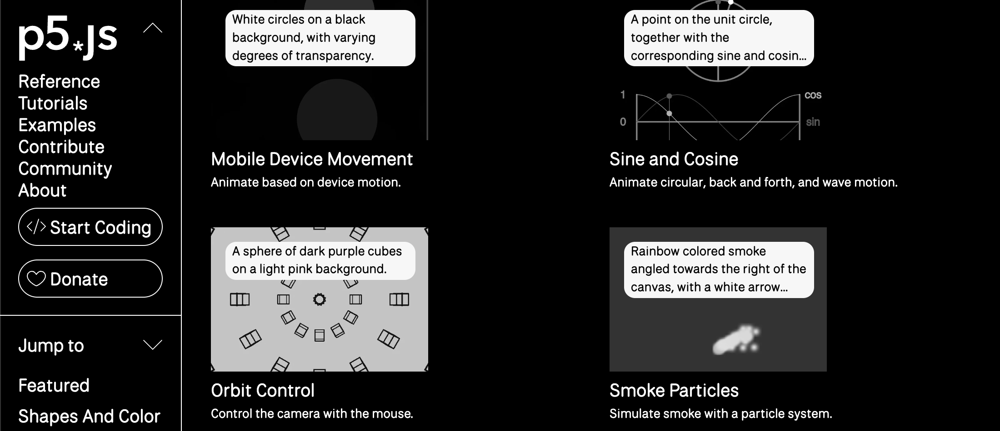

---

## 参考サイト：[OpenProcessing](https://openprocessing.org/)
- p5.js などで制作した作品をweb上で公開・共有できるプラットフォーム
- 各作品のコードが公開 されており、ブラウザ上で閲覧・実行・編集 が可能
- 表現の参考になるクリエイターの作品が多くアップされている

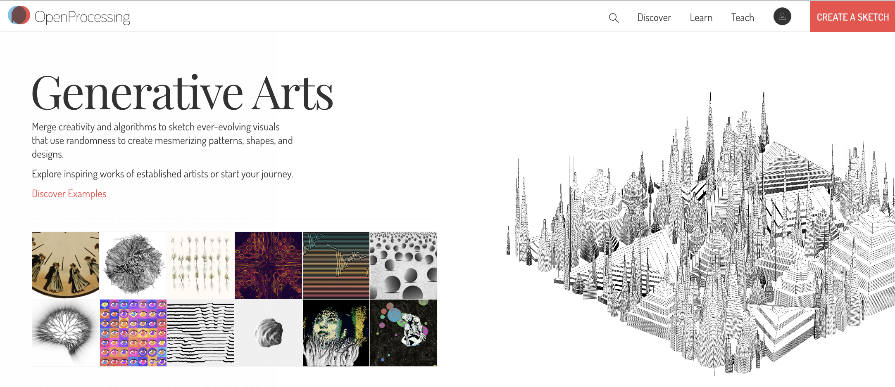

---

## 参考 YouTube Ch : [Coding Train](https://www.youtube.com/@TheCodingTrain/videos)

- Daniel Shiffman のYouTube
- ジェネラティブ・アートの書籍も執筆している
- [Nature of Code](https://natureofcode.com/) は物理シミュレーションを用いた表現を解説

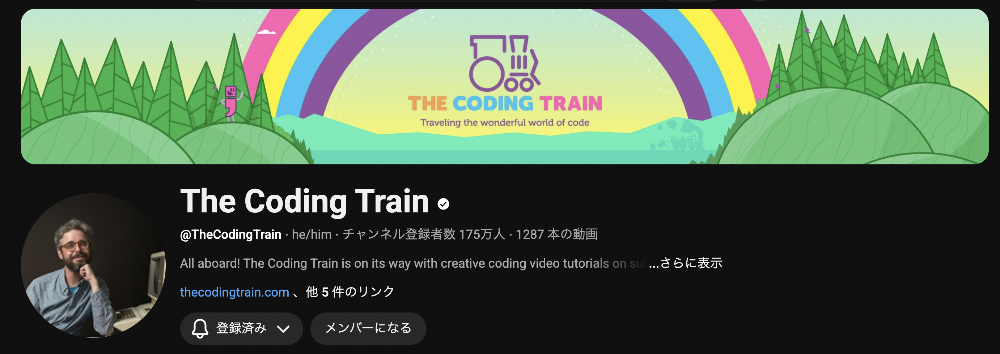

---

## 書籍 : [Generative Design](https://www.youtube.com/@TheCodingTrain/videos)

- p5.jsを使った色々なデザイン例が載っている書籍
- ラーニングコモンズに配下しています


---


## + 参考資料：授業のコードをまとめたサイト（[リンク](https://takanoma1990.github.io/p5js-slides/sample_code/index.html)）


